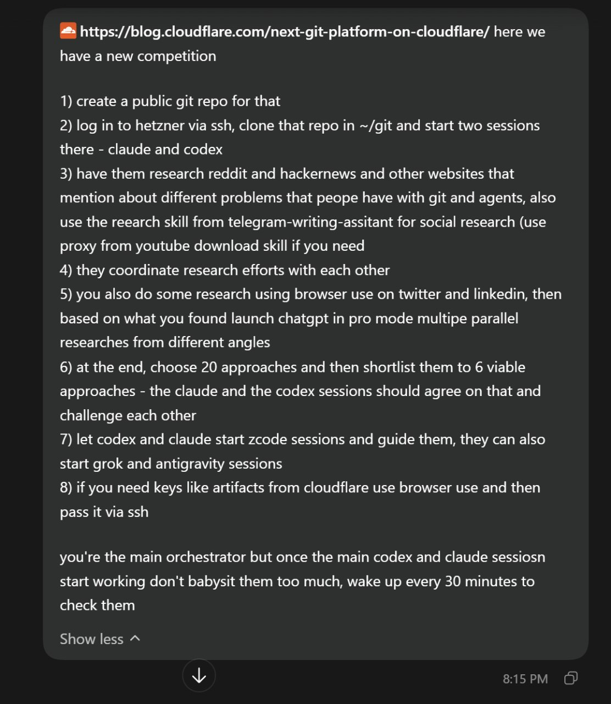

# Cloudflare Git for Agents Competition

On Saturday I decided to participate in the Cloudflare competition about building a platform for git. Not exactly for git - the idea is to build an alternative to git. Git was originally created for people, and it does not work well for agentic workloads. Agents need a different approach. For me, the main problem is that worktrees take up too much space.[^1]

I decided to try this for fun. I am doing a daily log of my progress. I described my approach on the first day. The plan is to keep logging every day and eventually turn this into a Substack article.[^1]

One thing I discovered is that the competition requires a paid Cloudflare Workers plan. I figured $5 is fine.[^1]

I also noticed that agents are slow to self-organize. They do not create other agents on their own - they just work. To have many agents running, I need to constantly intervene. I proposed having a dashboard where agents can see the current load and spawn as many agents as possible on their own.[^1]

Besides the git alternative itself, I want to get many additional side projects out of this competition.[^1]

I can participate but I cannot win anything because the prizes are only for US and Canada citizens. I am still interested in participating and learning something new.[^1]

## Cloudflare Competition Overview

Source: https://blog.cloudflare.com/next-git-platform-on-cloudflare/

On October 1, 2026, Cloudflare announced a competition to build the next Git platform on their infrastructure. The premise: GitHub was designed for human developers, but agents are already writing a growing share of code. When hundreds or thousands of agents work on the same codebase at the same time, the existing model of branches, pull requests, and code review does not hold up. Cloudflare wants participants to build what comes after GitHub.[^2]

The competition runs on Artifacts, Cloudflare's versioned filesystem that speaks Git and can scale to millions of repositories. Artifacts entered open beta alongside the competition announcement. It provides programmable primitives - you can create, fork, and manage repositories from a Worker using a binding API. The competition asks you to build the coordination layer on top: how agents discover what other agents are working on, how conflicting changes get resolved, how changes are reviewed, and how the developer experience works at agent scale.[^2]

The rules:[^2]

- Submissions are open until October 14, 2026
- Submit a 5-10 minute video demo, a link to source code under a permissive open source license (MIT, Apache, BSD), and instructions for running the project
- At minimum, the submission must show multiple agents working on changes concurrently
- Cloudflare is not looking for "GitHub with agents on top" - they want new ideas about what Git-based collaboration looks like in an agentic world

Prizes: the top three teams get flown to San Francisco for Cloudflare Connect. First place also receives $25,000 in Cloudflare credits and invitations to the VIP speaker dinner.[^2]

Artifacts capabilities relevant to building a competition entry:[^2]

- Workers binding API for creating and forking repos, reading files, inspecting commits, and issuing repo-scoped Git tokens - all from code running in a Worker
- Event subscriptions that fire on every push, clone, fork, or repo creation - you can wire these to kick off CI, code review, or deployment workflows
- Workers Builds integration - pushing to an Artifacts repo can trigger a build and deploy to Workers, with preview deployments for non-production branches
- Data jurisdiction controls (US or EU) at the namespace level
- Metrics and observability through the dashboard and API

The fork-based workflow is the intended pattern for agent coordination. When a task arrives, a Worker forks the project into an isolated repository for the agent, reads any instructions (like AGENTS.md), and hands the agent a remote URL and token. When the agent pushes changes, an event subscription can trigger the next step - review, merge, or comparison with other agents' work.[^2]

## Multi-Agent Orchestration Experiments

Before the competition, I experimented with running many agents in parallel. The orchestration approach: a main orchestrator coordinates multiple AI sessions (Claude, Codex, Grok, ChatGPT) across SSH connections on a Hetzner server. The sessions research a topic from different angles, then narrow down from 20 approaches to 6 viable ones through mutual challenge. The orchestrator checks in every 30 minutes rather than babysitting each session.[^3]

<figure>
  
  <figcaption>The orchestration prompt for running parallel research agents on a Hetzner server</figcaption>
  <!-- Shows the actual prompt used to coordinate multiple AI coding agents for the Cloudflare competition research phase -->
</figure>

## Sources

[^1]: [20261004_120600_AlexeyDTC_msg5000_transcript.txt](../../inbox/used/20261004_120600_AlexeyDTC_msg5000_transcript.txt)
[^2]: https://blog.cloudflare.com/next-git-platform-on-cloudflare/
[^3]: [20261002_210621_AlexeyDTC_msg4998_photo.md](../../inbox/used/20261002_210621_AlexeyDTC_msg4998_photo.md)
