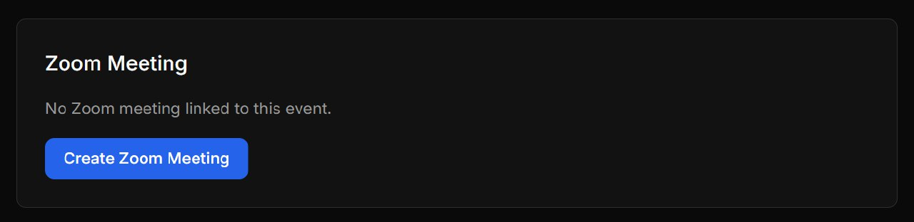
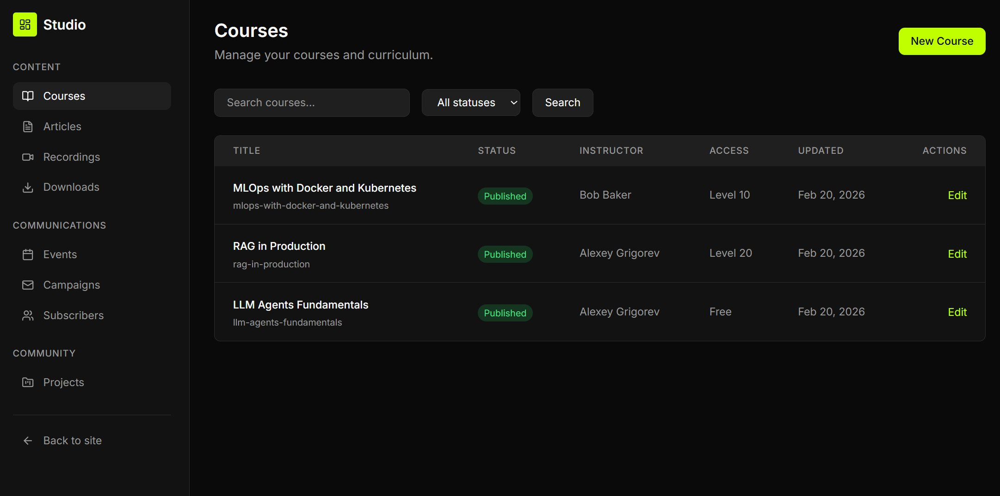
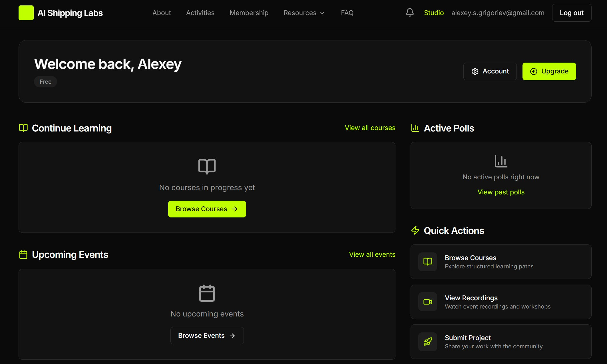
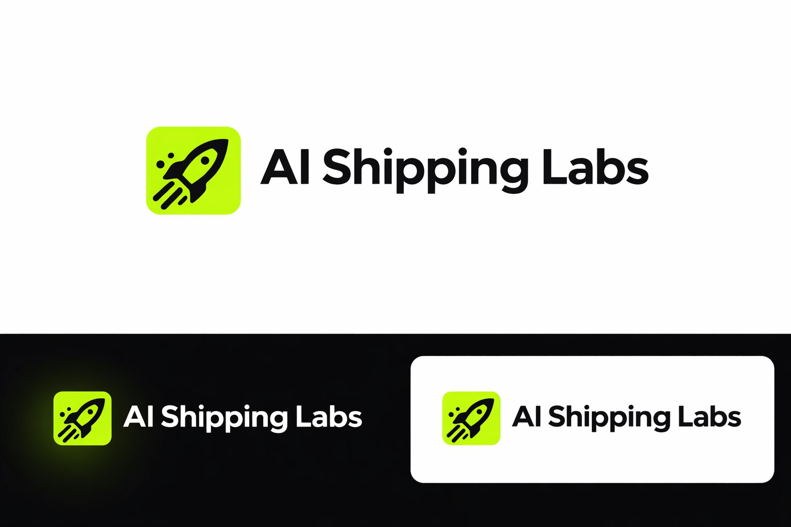
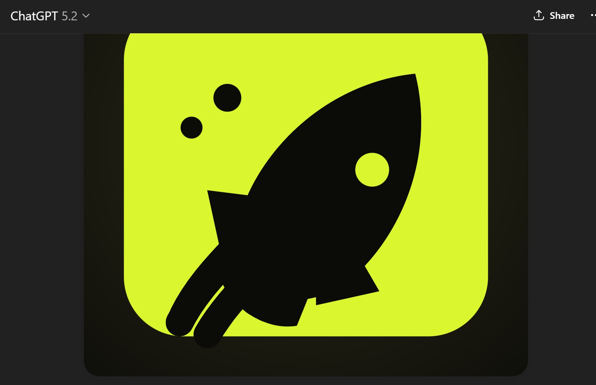
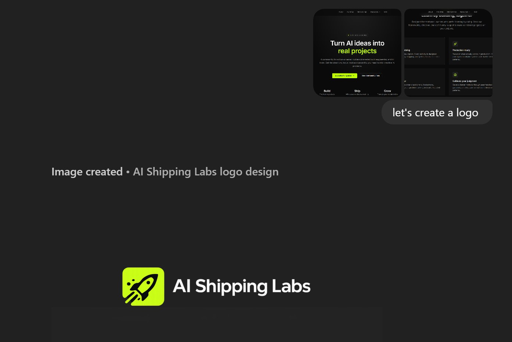

# Building a Community Platform with Claude Code's Multi-Agent System

I decided to build the AI Shipping Labs community platform using Claude Code with a multi-agent orchestrator pattern. This article documents the experiment - from requirements to a system of agents that worked autonomously through the night.

I broke one of the entrepreneur commandments here - "don't build before you validate." But I had unused Claude Pro Max tokens, and I wanted to practice this skill. If I can do brain dumps, have agents decompose them into tasks, and then execute autonomously - that is very valuable. Even if the idea doesn't work out and half of what the agent builds needs to be thrown away, the experience of setting this up is worth it. Ideally you would validate with real users first, run user interviews, and then build. But vibe coding is fun, and I understand the consequences[^10].

This is an experiment. I have no high expectations that everything will work perfectly on the first try. But it is interesting to see what happens[^13].

## Background: Choosing a Platform

We were choosing a platform for the community. The initial idea was to use Substack for subscriptions (three plans - monthly and annual) with all paid content behind a paywall, and a separate static site (like DataTalks.Club) linking to Substack. But Substack turned out not to support the tier plans we wanted[^1].

We started looking at other platforms. We wanted a Merchant of Record so we would not have to collect VAT ourselves - something like what Maven does. We found Ghost. Ghost seemed to fit what we needed. But as we started building a wishlist, Ghost did not fully match. For simple content behind a paywall - articles - Ghost works perfectly. For anything more complex, it falls short[^1].

## Gathering Requirements

Valeria and I started collecting a wishlist. I dictated features into the Telegram bot. Valeria discussed hers in ChatGPT and then we added those to the bot too. Then I worked with Claude Code on this list - grouping, restructuring, adding missing items. I pointed Claude Code at the existing site and said "here are the features we want for the community, analyze them, see what is missing in the requirements." It analyzed and added 5-6 more items to the requirements list[^2].

We got a list of what we need: what content to host, what features are required - Stripe, Zoom, and other integrations. No other platform we evaluated could handle all of it[^2].

## The Decision to Build

We planned to keep evaluating tools, trying platforms to see what fits and what does not. But then I thought - what if I just show Claude Code all these requirements and ask it to implement them? This idea came to me yesterday evening. I had been wanting to try Claude Code on a large project. I have been using it for three months now (since December) but only on small projects. I had enough experience to try something more complex[^2].

## Step 1: Requirements to Specifications

The first step, as always, is to understand what needs to be built. We had already done the preliminary work through the bot - dictating requirements. That requirements list was originally meant to help us choose the right existing platform, not to build our own. But the wishlist was already there[^3].

I took that list and told Claude to turn it into a specification - a spec for what the site should have. It created a "specification" folder with 15 files. I reviewed those files, gave feedback, and then said: "now turn these specs into tasks"[^3].

## Step 2: Task Decomposition

I had wanted to try storing task decomposition somewhere. I saw demos where people use Linear, Jira, or other tracking systems. I thought - let us try GitHub Projects. It has milestones, a kanban board. I told the agent to create tasks there[^4].

The result was not great. Milestones were unclear. Tasks were too granular - "add this class, add that class" - just a pile of them. But I had not given clear instructions. I just said "here are the specs, decompose into tasks and put them in GitHub Projects." The agent did it its own way. That is not how programmers work - programmers get bigger tasks like "integrate Slack," "integrate Zoom." Full, self-contained tasks[^4].

Plus the tasks had no acceptance criteria, no clear format[^4].

### Choosing Django

The project was already on Next.js. I decided to rewrite it to Django. This was my decision because I knew Django. Next.js uses JavaScript and TypeScript, and I might not be able to handle it. If something breaks, it is easier for me to understand Python code. I have known Django since 2010. Plus the course management platform is on Django, and I have done other Django projects recently. It was a safe choice - if something goes wrong, I can always fix it and tell the agent "here, you are doing this wrong, here are the best practices"[^4][^18].

### First Task: Migrate to Django

The first task was to migrate the existing site from Next.js to Django. A Django project consists of multiple applications. These applications are fairly independent of each other and work within one project. I supervised this, told the agent how things work in Django. The problem was that the agent decided to create too many apps - it wanted to make an app for every small thing. I said no, explained how to structure it properly. I decomposed everything with the agent, figured out what goes where. The task had clear acceptance criteria: the site must fully preserve the existing design and functionality[^4][^19].

### Iterating on Task Format

For the first task, I decided to try a different approach. I wanted something like the Ralph Loop (my previous experiment). With Ralph, the instructions were like "keep improving until the computer shuts down." Here I wanted specifics. First I wanted to decompose everything into clear tasks. Then I wanted the agent to take tasks from the pool of decomposed tasks and work until they are done[^5][^20].

I set the first task, then based on all the specs and how I framed the first task, I said: "now create the remaining tasks." I told the agent to put them in the filesystem first - just a "tasks" folder. Tasks that cannot be verified automatically should be tagged with "human." Acceptance criteria that cannot be checked automatically should be tagged "human" too[^5].

I iterated on the files until I liked the format. Once I said "yes, this is the task format I like," I told it to transfer all tasks to GitHub Issues. This happened in parallel - the agent was already migrating the site to Django while I was decomposing tasks[^5].

I now understand how to decompose tasks for agents. If I leave it to the agent, the issues it creates are not good. I have a clear format now that I can reuse for new projects[^9].

## Step 3: The Multi-Agent Architecture

I decided to try a new approach. Instead of doing everything in the main Claude Code session, I would use subagents[^6].

### Why Subagents

Two observations led to this:

1. If I already have a session with some dialog and start working on something new, it is better to start fresh (reset). The accumulated context can hurt.

2. The agent tests its own code poorly. Like with programmers and testers - a programmer writes something and is convinced their code works. You often need testers who bring an outside perspective. I noticed the same with agents - the code it implemented in this session, it remembers what it did, so it has a biased view[^6].

### The Architecture

I ended up with two core subagents: one Software Engineer and one Tester. The Software Engineer implements a feature, says "I am done." Then verification passes to the Tester. The Tester checks and says "you messed up here, here, and here." This goes back to the Software Engineer. They iterate until both agree the task is done - the Software Engineer says "ready" and the Tester accepts[^6].

I made an agent-orchestrator (manager) that calls these subagents. The orchestrator purely manages - it has no biased relationship with the code. If I ran everything in the main session and then ran a tester in the same session, the tester might say "nah, it is fine" and do nothing. With separate subagents, the orchestrator calls the Software Engineer, the Software Engineer implements, then the orchestrator calls the Tester, the Tester tests, and the orchestrator passes Tester feedback back to the Software Engineer. Since these are subagents, they can work in parallel[^6].

### The Work Loop

The orchestrator looks at GitHub Issues, pulls two tasks. I open a Claude Code session, say "look at what tasks are in GitHub, sort them, pick two by some criteria." For each task it launches a Software Engineer, and after the Software Engineer finishes, it launches a Tester. The two tasks should ideally be independent so they can run in parallel[^7].

<figure>
  
  <figcaption>Claude Code orchestrator managing parallel tasks - Software Engineer and Tester agents working on different features simultaneously</figcaption>
  <!-- First screenshot showing the multi-agent system in action with task list -->
</figure>

When the orchestrator picks the next tasks, it checks dependencies to decide which ones are available. It filters out issues that are blocked by other tasks or require human input, then selects from what remains[^21].

<figure>
  
  <figcaption>The agent analyzing remaining issues and their dependencies to decide which tasks to pick up next</figcaption>
  <!-- Screenshot showing the agent's reasoning about issue selection based on dependency chains -->
</figure>

I wanted the orchestrator to keep working until the backlog is empty. The trick: I add a task that says "when you finish all current tasks, go to GitHub, pull the next two issues, and add them to the todo list." This creates a loop - when work finishes, it picks the next two tasks and assigns them to the Software Engineer and Tester cycle. It keeps going until there are no more tasks on GitHub[^7].

### The On-Call Engineer

The second task was to set up CI/CD - so that tests run automatically. I added a third subagent whose job is to monitor CI/CD status after each push. If something breaks, this agent finds who is responsible, opens an issue, documents what broke, and tries to fix it[^8].

The orchestrator coordinates: if the On-Call Engineer says "something is broken" but the Software Engineer is currently working on that area, the orchestrator says "calm down, the Software Engineer is working on this, wait." But if the Software Engineer finished a feature and pushed it, and that broke something else - the On-Call Engineer fixes it independently. Its job is to keep CI/CD green[^8].

### Adding the Product Manager

I renamed the agents. The implementer became "Software Engineer" because it sounds better. I also added a Product Manager role. I want to be able to create an issue myself and then tell the PM: "now figure out how this should look in practice, how to properly implement it." In real work, the PM usually has the final say in acceptance - not just the Tester. The Tester checks everything from the user's perspective, but the PM should have the last word[^26][^27].

The Product Manager's responsibilities:

- Grooming tasks and decomposing them into actionable issues
- Writing issues with clear requirements
- Creating test scenarios (the current scenarios were not great)
- Having the final say in acceptance - either accepting or rejecting the result[^27][^28]

<figure>
  
  <figcaption>The renamed agent roles and their configuration files</figcaption>
  <!-- Screenshot showing the new agent naming convention -->
</figure>

### Why Not Ralph Loop

Ralph Loop would not work well here because the subagents run in the background. The orchestrator launches an agent and then waits - it does nothing until the subagent finishes and reports back. The stop hook from Ralph would probably trigger while the subagent is still working but the orchestrator is "sleeping." The todo-list-based loop works better for this[^4b].

## Testing Strategy

No deployment yet - everything runs locally. I ask the agents to write tests: unit tests, integration tests, and end-to-end tests with Playwright[^11].

At first it was funny - the Tester looked at the Software Engineer's work and said "yes, everything looks great, I will not run tests because I need a browser, so sorry, I accept everything." I said "wait a minute, install the browser" and tightened the Tester acceptance criteria to be more strict. After that fix, both the Tester and the Software Engineer know how to run end-to-end tests. If they get lazy and skip tests, CI/CD will catch it and they will get feedback that something does not work[^11].

## Communication via GitHub

I told the subagents to use GitHub as their communication channel. They push code and leave comments on issues - "I implemented this," "I tested this, these tests failed." I also ask them to use checklists in acceptance criteria so I can see progress. I cannot look inside a subagent's session. Unlike the main session where I can see what is happening, with a subagent I can only roughly guess by looking at git diff. So I decided they should write updates to GitHub so I can check the status of any task at any moment[^12].

I first considered doing it "properly" - like in a company: take an issue, create a branch, work in that branch, create a pull request, someone reviews it, leaves comments. But then I thought that is too much overhead. It is simpler if they all work in one branch (main), multiple agents at once, without all the pull request ceremony. The project just started. If it takes off and needs to be developed further, then we can add pull requests like Claude Pilot does. For now, during intensive development, switching branches back and forth would waste too much time. Let them commit everything to main. If something breaks in parallel, it is not the end of the world[^12].

## Setup Time and Process

Setting all this up took about 1.5 hours yesterday evening. I was working on course material in parallel - switching between course content and agent setup. When agents were working on the site, I switched to the course. When the course agent was running, I checked on the site agents. About 50/50 attention split[^14].

I think next time it will take much less time because I can reuse things. I now understand what instructions to give the agent right away[^14].

<figure>
  
  <figcaption>Morning check - the agent worked all night, completing 41 out of 46 tasks</figcaption>
  <!-- Screenshot showing progress after the agent ran autonomously overnight -->
</figure>

The agent worked all night. I have not looked at the code yet. My goal today is to finish the course week, and then I will review what the agent built during the day[^4b].

<figure>
  
  <figcaption>After 12 hours of autonomous work - 56 tasks, 51 completed, still going</figcaption>
  <!-- Screenshot showing the agent still working after 12 hours, with 51 of 56 tasks done -->
</figure>

I do not know if it is a good idea to let the agents work on projects completely without supervision, but that is what I do. I do not have time to check the results. After 16 hours it was still going - two Software Engineer agents running in parallel on background jobs infrastructure and email authentication, with SEO tasks already completed[^22].

<figure>
  
  <figcaption>After 16 hours of unsupervised work - two Software Engineer agents still running, picking up new tasks automatically</figcaption>
  <!-- Screenshot showing the agents continuing to work autonomously after 16 hours -->
</figure>

## Slack Integration

People voted for Slack as the community platform. We set up a new Slack workspace for AI Shipping Labs, and the agents are already working on integrating Slack into the site[^15][^16].

<figure>
  
  <figcaption>New Slack workspace for the AI Shipping Labs community</figcaption>
  <!-- Screenshot of the freshly created Slack workspace -->
</figure>

## Continued Progress

The agent kept going. I am afraid to open the code. "Pot, stop cooking" - Claude keeps working on the project.[^23]

<figure>
  
  <figcaption>Claude committing email+password authentication - 11 files changed, 1675 insertions</figcaption>
  <!-- Screenshot showing a large commit for authentication feature, demonstrating the agent's autonomous work -->
</figure>

Looks like something important is happening - 15 tasks total with 10 done, 2 in progress, and 3 open. The agent is working on Slack integration, newsletter signup, and SEO tasks.[^24]

<figure>
  
  <figcaption>Task progress - 15 tasks, 10 completed, working on Slack, newsletters, and SEO</figcaption>
  <!-- Screenshot showing the orchestrator's task list with community features being implemented -->
</figure>

## Example Task Format

Here is an example of what a task for the agent looks like - [GitHub Issue #84: Zoom Integration](https://github.com/AI-Shipping-Labs/website/issues/84). It has a clear scope describing what needs to be implemented (Zoom API integration, webhook endpoint, recording handling) and acceptance criteria with checkboxes, including a "HUMAN" tag for criteria that cannot be verified automatically.[^25]

## First Look at the Results

This is what Claude did for the website after 1.5 days of work. The first time I tried to log in was yesterday. I made the login and noticed there was no homepage for authenticated users. I told it to make one. A day later I came back - and this is what I saw[^30].

<figure>
  
Video: Screen recording of the site after 1.5 days of Claude's autonomous work (1m 51s, 2146x1258) - <a href="https://t.me/c/3688590333/2168">View on Telegram</a>

  <figcaption>Reviewing what Claude built for the website - first look after telling it to add a homepage for authenticated users</figcaption>
  <!-- Screen recording showing the state of the community platform after 1.5 days of autonomous agent work -->
</figure>

## Reflection: You Still Need to Manage the Agents

About vibe coding - I have the same experience as others. Even if you create as many sub-agents as you want, you still need to manage them. Phil Winder [wrote about migrating a Python codebase to Go using Claude Code](https://www.linkedin.com/posts/drphilwinder_i-just-migrated-a-production-python-codebase-activity-7430343296205459456-eXUm) and concluded: "Claude is a powerful but literal executor. The gaps in your design become the bugs in your system." This matches what I see - without control, agents do not produce good results on their own[^29].

<figure>
  
  <figcaption>Phil Winder's post about the challenges of AI-driven cross-language migration</figcaption>
  <!-- LinkedIn post that resonates with the experience of needing to manage AI agents -->
</figure>

## Testing the Features

I finally got around to checking the features on the Labs site. Some things had been sitting with the "human" tag. By the process I asked the agent to follow, features that require human verification are marked with the "human" tag and not closed automatically. I started going through the GitHub issues tagged "human"[^31].

### OAuth Tokens

I needed to create OAuth tokens for Gmail and GitHub so the sign-in buttons would work. I generated tokens for both. Claude told me to add them to the .env file[^31].

### Zoom Integration

The Zoom integration worked, but initially not the way I wanted to use it. It was not fully configured. You had to create events through the admin panel, and then it would make a Zoom meeting. I said I want a button instead. It was remade a bit, and everything worked[^31][^32].

<figure>
  
  <figcaption>The "Create Zoom Meeting" button on an event page</figcaption>
  <!-- Shows the button that triggers Zoom meeting creation for an event -->
</figure>

I press "Create Meeting" and it creates a meeting. Zoom automatically creates a meeting when an event is created[^32][^36].

<figure>
  
  <figcaption>Zoom meeting automatically created for an event</figcaption>
  <!-- Shows the result after clicking Create Meeting - a Zoom meeting with ID and join URL -->
</figure>

I left some remarks about the interface - things I did not like. But those are about comfort, not functionality. The functionality works. I asked the agent to create GitHub issues for the UI improvements, and asked another agent to start implementing them[^32].

### New Features: Recordings to S3 and YouTube

I created a new feature request: Zoom recordings should automatically go to S3. I do not want to store recordings only in Zoom. They should automatically end up in S3, and people who missed events can watch them from there. All automatically, without any manual work. I also asked to set up automatic upload of everything to YouTube. I do not know if it will work, but it is cool[^32].

### The Admin Panel and User Dashboard

This is what the admin panel looks like - a course management dashboard showing courses, their status, instructors, and access levels[^37].

<figure>
  
  <figcaption>The admin panel (Studio) showing course management</figcaption>
  <!-- Screenshot of the admin dashboard with course list, demonstrating what the agent built -->
</figure>

And this is the home screen that a user sees after logging in. It shows sections for continuing learning, active polls, upcoming events, and quick actions[^38].

<figure>
  
  <figcaption>User home screen after logging in to AI Shipping Labs</figcaption>
  <!-- Shows the authenticated user experience that the agent built -->
</figure>

### Remaining Work

What is still left to check:

- Email sending - I need to set this up myself
- Stripe integration - I do not know yet how to test automatic upgrades. When someone pays, their account should upgrade automatically
- Slack auto-add - when someone pays, Slack access should be added automatically
- Deployment - still need to figure out how to organize this[^32][^33]

The specific flow I want to test now: make a purchase in Stripe and get automatically added to Slack. Currently there are only two people in Slack. I want to verify that after paying, a new account becomes the third person[^34].

### Content Management Vision

I want articles stored on GitHub because it is much simpler to manage them in markdown than through the site interface. My vision: you work in GitHub, push, and a GitHub Action fires that automatically updates the site. I prefer this to going to the site and editing there. First, I can use all the tools I already use for this. Second, automation. Right now when I write courses, everything is in GitHub and then I have to manually transfer it to the site. I want to just commit to GitHub and have it automatically appear on the site. This still needs to be finalized[^33].

### Overall Impressions

I am surprised that things just work out of the box. I have only checked two features so far (OAuth and Zoom), but I already like the result. I was worried the agent would produce garbage since it worked for a long time. But the process of having features well-planned first, with multiple agents with different roles - this setup seems to work[^31].

There is a lot of work and not much time. I will test Stripe now so we can launch and people can start joining[^33].

## Logo Design with ChatGPT

I asked ChatGPT to create the logo for AI Shipping Labs[^39].

<figure>
  
  <figcaption>Logo created by ChatGPT - AI Shipping Labs branding with rocket ship icon</figcaption>
  <!-- The initial logo design created by ChatGPT showing multiple variations -->
</figure>

I asked ChatGPT to re-create the logo in SVG. It thought for 3 minutes and created this[^40]:

<figure>
  
  <figcaption>First SVG logo attempt - ChatGPT thought for 3 minutes</figcaption>
  <!-- First attempt at SVG recreation of the logo, showing ChatGPT 5.2 interface -->
</figure>

Attempt number 2[^41]:

<figure>
  
  <figcaption>Second SVG attempt - thought for 6 minutes 57 seconds</figcaption>
  <!-- Second attempt at recreating the logo in SVG, took almost 7 minutes of thinking -->
</figure>

<figure>
  
  <figcaption>Website design with the AI Shipping Labs logo and tagline</figcaption>
  <!-- Screenshot showing how the logo looks in context on the actual website design -->
</figure>

## All Integrations Complete

Login through Gmail and GitHub is integrated. Zoom, Slack, and Stripe are all integrated now. Everything is connected. The bot continues to write code - what I did not like, I commented on, and the agent continues working on it[^42].

The integrations are all there. I will start inviting people from AI Engineering Buildcamp because things are mostly ready[^43].

## Sources

[^1]: [20260219_062529_AlexeyDTC_msg1997_transcript.txt](../inbox/used/20260219_062529_AlexeyDTC_msg1997_transcript.txt)
[^2]: [20260219_062807_AlexeyDTC_msg1998_transcript.txt](../inbox/used/20260219_062807_AlexeyDTC_msg1998_transcript.txt)
[^3]: [20260219_062925_AlexeyDTC_msg1999_transcript.txt](../inbox/used/20260219_062925_AlexeyDTC_msg1999_transcript.txt)
[^4]: [20260219_063619_AlexeyDTC_msg2000_transcript.txt](../inbox/used/20260219_063619_AlexeyDTC_msg2000_transcript.txt)
[^4b]: [20260219_071706_AlexeyDTC_msg2004_transcript.txt](../inbox/used/20260219_071706_AlexeyDTC_msg2004_transcript.txt)
[^5]: [20260219_063854_AlexeyDTC_msg2001_transcript.txt](../inbox/used/20260219_063854_AlexeyDTC_msg2001_transcript.txt)
[^6]: [20260219_070828_AlexeyDTC_msg2002_transcript.txt](../inbox/used/20260219_070828_AlexeyDTC_msg2002_transcript.txt)
[^7]: [20260219_071538_AlexeyDTC_msg2003_transcript.txt](../inbox/used/20260219_071538_AlexeyDTC_msg2003_transcript.txt)
[^8]: [20260219_072120_AlexeyDTC_msg2006_transcript.txt](../inbox/used/20260219_072120_AlexeyDTC_msg2006_transcript.txt)
[^9]: [20260219_072413_AlexeyDTC_msg2009_transcript.txt](../inbox/used/20260219_072413_AlexeyDTC_msg2009_transcript.txt)
[^10]: [20260219_072541_AlexeyDTC_msg2010_transcript.txt](../inbox/used/20260219_072541_AlexeyDTC_msg2010_transcript.txt)
[^11]: [20260219_072242_AlexeyDTC_msg2007_transcript.txt](../inbox/used/20260219_072242_AlexeyDTC_msg2007_transcript.txt)
[^12]: [20260219_071912_AlexeyDTC_msg2005_transcript.txt](../inbox/used/20260219_071912_AlexeyDTC_msg2005_transcript.txt)
[^13]: [20260219_072844_AlexeyDTC_msg2013_transcript.txt](../inbox/used/20260219_072844_AlexeyDTC_msg2013_transcript.txt)
[^14]: [20260219_072356_AlexeyDTC_msg2008_transcript.txt](../inbox/used/20260219_072356_AlexeyDTC_msg2008_transcript.txt)
[^15]: [20260219_091611_AlexeyDTC_msg2022_transcript.txt](../inbox/used/20260219_091611_AlexeyDTC_msg2022_transcript.txt)
[^16]: [20260219_072835_AlexeyDTC_msg2011_transcript.txt](../inbox/used/20260219_072835_AlexeyDTC_msg2011_transcript.txt)
[^17]: [20260219_072844_AlexeyDTC_msg2012_transcript.txt](../inbox/used/20260219_072844_AlexeyDTC_msg2012_transcript.txt)
[^18]: [20260219_110511_AlexeyDTC_msg2058_transcript.txt](../inbox/used/20260219_110511_AlexeyDTC_msg2058_transcript.txt)
[^19]: [20260219_110549_AlexeyDTC_msg2060_transcript.txt](../inbox/used/20260219_110549_AlexeyDTC_msg2060_transcript.txt)
[^20]: [20260219_110655_AlexeyDTC_msg2062_transcript.txt](../inbox/used/20260219_110655_AlexeyDTC_msg2062_transcript.txt)
[^21]: [20260219_104931_AlexeyDTC_msg2055_photo.md](../inbox/used/20260219_104931_AlexeyDTC_msg2055_photo.md)
[^22]: [20260219_142441_AlexeyDTC_msg2072_photo.md](../inbox/used/20260219_142441_AlexeyDTC_msg2072_photo.md)
[^23]: [20260219_162515_AlexeyDTC_msg2085_photo.md](../inbox/used/20260219_162515_AlexeyDTC_msg2085_photo.md)
[^24]: [20260219_162528_AlexeyDTC_msg2087_photo.md](../inbox/used/20260219_162528_AlexeyDTC_msg2087_photo.md)
[^25]: [20260219_164639_AlexeyDTC_msg2089.md](../inbox/used/20260219_164639_AlexeyDTC_msg2089.md)
[^26]: [20260220_131018_AlexeyDTC_msg2142_photo.md](../inbox/used/20260220_131018_AlexeyDTC_msg2142_photo.md)
[^27]: [20260220_135351_AlexeyDTC_msg2146_transcript.txt](../inbox/used/20260220_135351_AlexeyDTC_msg2146_transcript.txt)
[^28]: [20260220_135418_AlexeyDTC_msg2148_transcript.txt](../inbox/used/20260220_135418_AlexeyDTC_msg2148_transcript.txt)
[^29]: [20260220_143527_AlexeyDTC_msg2156_photo.md](../inbox/used/20260220_143527_AlexeyDTC_msg2156_photo.md)
[^30]: [20260220_155647_AlexeyDTC_msg2169.md](../inbox/used/20260220_155647_AlexeyDTC_msg2169.md), [20260220_155647_AlexeyDTC_msg2168_video.md](../inbox/used/20260220_155647_AlexeyDTC_msg2168_video.md)
[^31]: [20260225_163430_AlexeyDTC_msg2408_transcript.txt](../../inbox/used/20260225_163430_AlexeyDTC_msg2408_transcript.txt)
[^32]: [20260225_163608_AlexeyDTC_msg2410_transcript.txt](../../inbox/used/20260225_163608_AlexeyDTC_msg2410_transcript.txt)
[^33]: [20260225_163818_AlexeyDTC_msg2412_transcript.txt](../../inbox/used/20260225_163818_AlexeyDTC_msg2412_transcript.txt)
[^34]: [20260225_164017_AlexeyDTC_msg2414_transcript.txt](../../inbox/used/20260225_164017_AlexeyDTC_msg2414_transcript.txt)
[^35]: [20260225_164039_AlexeyDTC_msg2416_transcript.txt](../../inbox/used/20260225_164039_AlexeyDTC_msg2416_transcript.txt)
[^36]: [20260225_164129_AlexeyDTC_msg2418_photo.md](../../inbox/used/20260225_164129_AlexeyDTC_msg2418_photo.md), [20260225_164203_AlexeyDTC_msg2420_photo.md](../../inbox/used/20260225_164203_AlexeyDTC_msg2420_photo.md)
[^37]: [20260225_164233_AlexeyDTC_msg2422_photo.md](../../inbox/used/20260225_164233_AlexeyDTC_msg2422_photo.md)
[^38]: [20260225_164305_AlexeyDTC_msg2424_photo.md](../../inbox/used/20260225_164305_AlexeyDTC_msg2424_photo.md)
[^39]: [20260225_185904_AlexeyDTC_msg2433_photo.md](../../inbox/used/20260225_185904_AlexeyDTC_msg2433_photo.md)
[^40]: [20260225_185921_AlexeyDTC_msg2435_photo.md](../../inbox/used/20260225_185921_AlexeyDTC_msg2435_photo.md)
[^41]: [20260225_190002_AlexeyDTC_msg2437_photo.md](../../inbox/used/20260225_190002_AlexeyDTC_msg2437_photo.md), [20260225_190543_AlexeyDTC_msg2439_photo.md](../../inbox/used/20260225_190543_AlexeyDTC_msg2439_photo.md)
[^42]: [20260225_201000_AlexeyDTC_msg2445_transcript.txt](../../inbox/used/20260225_201000_AlexeyDTC_msg2445_transcript.txt)
[^43]: [20260225_201916_AlexeyDTC_msg2449_transcript.txt](../../inbox/used/20260225_201916_AlexeyDTC_msg2449_transcript.txt)
