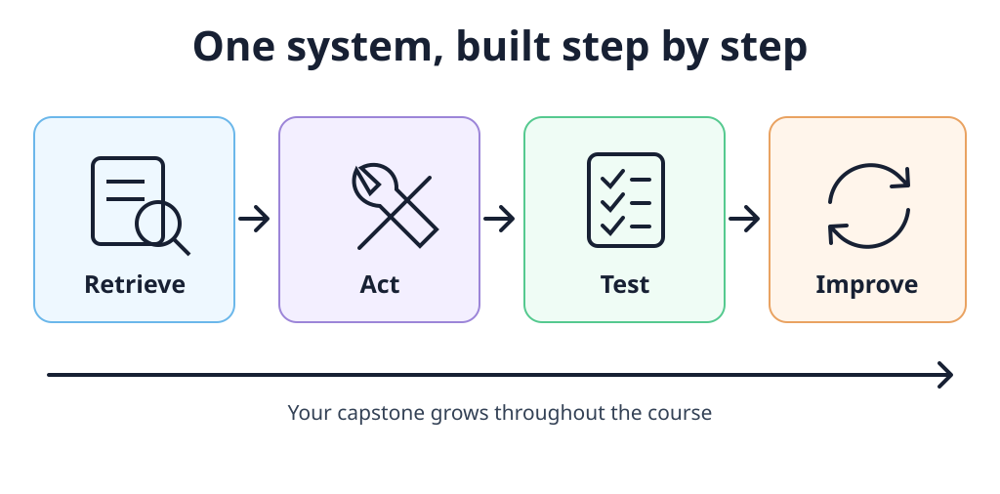
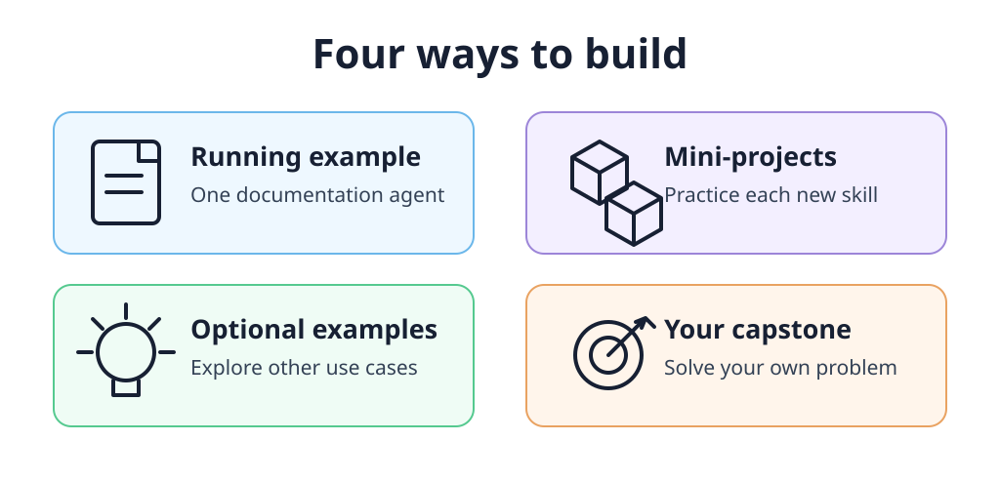
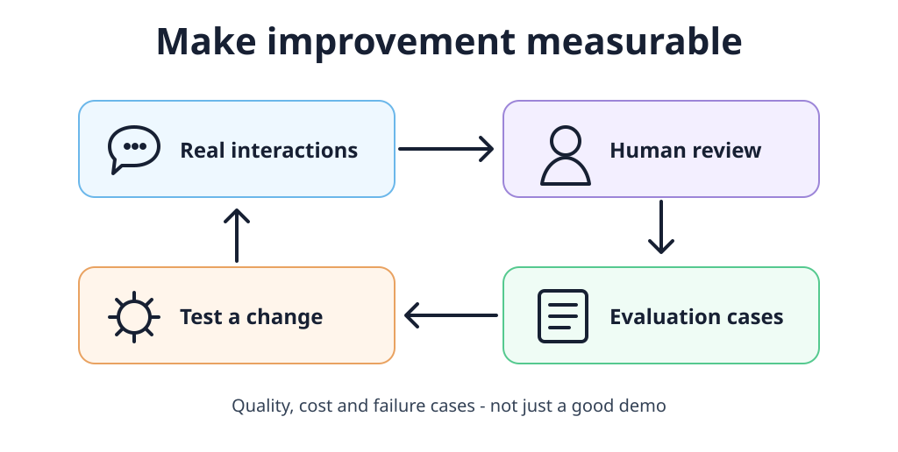

# From RAG to Agents: What You Build in AI Engineering Buildcamp

The projects, the learning process, and what I changed after three cohorts.

In the latest cohort of AI Engineering Buildcamp, participants built an exam generator, a chess coach, a research assistant, and several tools for learning and finding a job. I shared [all 13 projects in my previous post](https://aishippingblog.com/p/13-ai-projects-from-ai-engineering).

These applications look different, but they raise similar engineering questions. Where does the information come from? Which tools can the agent use? How do you know an answer is good? What happens when a model call fails?

That is what I want people to learn in this course. Not just how to get a response from an LLM, but how to build an application around it, inspect what it does, and improve it.

In this post, I’ll explain how the course works, what you build along the way, and what changed after the first cohorts.

Your project grows throughout the course. It is not something you start after watching the last lesson.

## One application, built step by step

The main example is a Documentation Agent that works with the Evidently documentation. We keep returning to this application as we add new capabilities. This gives you one system to understand rather than a new, unrelated demo in every module. I described this structure in the [course walkthrough](https://aishippingblog.com/p/last-call-for-ai-engineering-buildcamp).

We start with a basic RAG pipeline: prepare the documents, make them searchable, retrieve relevant information, and use it to answer a question. The first version does not need a complicated architecture. It needs to help us see what happens between the user’s question and the answer.

Eduardo Gonzalo Almorox wrote about this in his [week-one learning notes](https://www.linkedin.com/posts/edugonzaloalmorox_lessons-from-the-first-week-of-the-ai-bootcamp-activity-7385917817474322432-q2G-). He found search the most challenging part, and highlighted how much parsing, chunking, and the right context matter. His post is a useful view of the course from the learner’s side: the work starts with the data, not with collecting framework names.

Next, we give the application tools. Instead of always following a fixed retrieval pipeline, it can decide which function to call and use the result in the next step.

In the [redesigned course](https://aishippingblog.com/p/ai-bootcamp-becomes-ai-engineering), we first build the tool-calling loop ourselves. Then we use PydanticAI as the main framework. I want you to understand what the framework is doing for you. Other frameworks and providers are available as optional material; you do not need to learn all of them to complete your project.

After that, the focus shifts from adding features to understanding behavior: testing, monitoring, evaluation, and making improvements based on what you observe.

## Four ways to practice

There are four kinds of project work in the course. They have different purposes, and separating them is important, especially when you study alongside a full-time job. The [published curriculum](https://aishippingblog.com/p/last-call-for-ai-engineering-buildcamp) explains how they fit together.

The running example is the Documentation Agent. We use it to learn the core workflow and see how the pieces connect.

The homework mini-projects give you a different problem to solve with the same ideas. Examples include a Wikipedia agent, a SQL agent over taxi data, and a recipe assistant with evaluation scenarios. You get practice applying the concept instead of only repeating the demo.

The optional examples show other directions: working with PDFs, summarizing YouTube videos, web research, coding agents, and code analysis. They are there when they help your goals. They are not a requirement to build every possible agent.

Your capstone is the application you choose. You start thinking about it early and apply each new topic to the same project.

Follow the core path, practice on smaller problems, and use the optional material when it helps your own project.

The capstone does not have to be ambitious on day one. A narrow problem with data you can actually use is a better starting point than a large system with five agents and no clear user.

For example, “help me find the relevant part of these documents” gives you something concrete to build and evaluate. Once that works, you can decide whether it needs more tools, a different interface, or a more elaborate workflow.

## Testing and evaluation are part of building

A demo can look convincing even when it fails on the next question. I want the course project to give you a way to discover those failures.

The course introduces tests with pytest, then adds monitoring and more systematic evaluation. We look at interactions, define what a good result means, label examples, and compare an LLM judge with human judgments. These are part of the [core learning path](https://aishippingblog.com/p/last-call-for-ai-engineering-buildcamp), not only optional additions to a finished app.

Vancesca Dinh, who built a Habit Builder in the first cohort, made the same point in a [public comment about the course](https://www.linkedin.com/posts/agrigorev_just-got-a-new-review-for-my-ai-bootcamp-activity-7409140793849851904-wXX7):

> “Evaluation should run parallel to developing reliable agentic systems.”

A useful question is not simply “Does my agent answer?” It is “What evidence would convince me that this change made it better?”

That could mean checking whether retrieval returns the right document, whether the agent chooses the appropriate tool, or whether it correctly refuses a request outside its scope. It also means looking at costs and failures, not just the successful interaction you show on demo day.

Turn interactions into reviewed test cases, then use those cases to check the next change.

Amar Agrawal’s [ATS Gap Analyser](https://github.com/Amar-Ag/ats-gap-analyser) is a good example. His README documents 50 evaluation scenarios and several iterations of an LLM judge. It also lists failures and known limitations.

One important detail: the reported 88% recall belongs to the judge’s ability to detect failures. It is not an 88% hiring success rate, and it is not proof that the application reproduces an employer’s screening system. Keeping those distinctions clear is part of evaluating an AI application properly.

## What participants have built

The best way to understand the course is to look at the projects. Here are a few examples and the engineering choices that make them interesting.

### A chess coach built around actual games

Leo Cabibihan’s [Chess Coach Agent](https://github.com/leo-cabibihan/chess-coach-agent) turns imported games into positions to practice. It uses Stockfish for move analysis and combines that with explanations, stored progress, and review sessions.

The interesting part is that the application is not just a chat window with a chess prompt. It has a specific workflow: import a game, find a weak moment, practice the position, and return to it later. The repository also documents offline testing and deterministic fallbacks.

### A tool for preparing documents, without a chat interface

Paulien Out and Alena Fojtik built a [Document Preparation Agent](https://github.com/PaulienOut/rag-dataprep-agent). Their problem was upstream of the final answer: documents needed useful metadata and structure before they could work well in a retrieval system.

Their project prepares PDFs with information such as author, document type, summaries, and numbered chunks. The demo uses public documents rather than private customer data. It is a useful reminder that an AI project does not need a polished chat interface to solve a real engineering problem.

### An assistant for choosing bikepacking equipment

Eduardo’s [bAIpacking Agent](https://github.com/edugonzaloalmorox/baikpacking-agent) uses race reports to help cyclists research equipment choices. It retrieves evidence about events and rider setups, then summarizes that information for the user.

This is a specific problem with a specific source of data. It also connects nicely to his early learning notes about retrieval: choosing what to search and how to prepare it remains important after you add an agent.

### A SQL assistant with a limited job

Lars van Asseldonk’s [Datawarehouse Agent](https://github.com/larsvasseldonk/datawarehouse_agent) separates clarifying a question from generating and executing SQL. It returns the answer together with the query used, and its intended database access is read-only.

The repository uses locally seeded data for a railway-incident warehouse. This is a capstone prototype, not a claim that Dutch Railways has deployed the application. The README also distinguishes existing features from future work, including containerization and CI.

That distinction matters. A useful project explains both what works and what still needs to be done.

There are many other directions in the [second-cohort](https://aishippingblog.com/p/9-real-life-ai-projects-from-ai-engineering) and [third-cohort showcases](https://aishippingblog.com/p/13-ai-projects-from-ai-engineering): voice notes turned into GitHub issues, research-paper recommendations, video-based learning tools, and career-evidence libraries. You do not have to build my example. You use the course to build something relevant to you.

## What I changed after the first cohorts

The first version was called AI Bootcamp. In January, I [renamed it AI Engineering Buildcamp and re-recorded about 90% of the content](https://aishippingblog.com/p/ai-bootcamp-becomes-ai-engineering).

The feedback was not that there was too little material. Some participants found the material valuable but the pace too fast. I needed to make the path through it clearer.

The changes included separating the essential material from optional examples, giving the core concepts more room, and making the progression easier to follow. The published nine-week structure also includes a buffer week and time to refine the capstone, rather than treating every week as another dense batch of new topics.

Starting the project earlier is another important part of this. In a [cohort-two review I shared](https://www.linkedin.com/posts/agrigorev_got-a-new-review-from-cohort-2-of-the-ai-activity-7451162686756806657-dxeo), Vishnu highlighted building from the first week and getting help shaping an idea along the way. You do not need a complete specification before joining, but postponing the project until the end makes the work harder.

There has also been encouraging feedback. Scott DeGeest described the course as worthwhile and comprehensive in a [testimonial I shared publicly](https://www.linkedin.com/posts/agrigorev_just-received-a-new-testimonial-for-the-ai-activity-7404535444891414528-hfe1). Those comments are useful, but so is the feedback about where people get stuck.

As I wrote in the [latest project showcase](https://aishippingblog.com/p/13-ai-projects-from-ai-engineering), I still want more participants to reach the finish line with a completed project. That remains a priority. I do not want to present the showcased projects as a promise that everyone will finish automatically.

## Who this course is for

This is a coding course. You should be comfortable working with Python, Git, Docker, and the command line. It is intended for software engineers, data scientists, ML engineers, and other developers who want to build an end-to-end AI application. The [course page](https://maven.com/alexey-grigorev/from-rag-to-agents) has the prerequisites.

You do not need to arrive with an advanced agent architecture. You do need time to write code, inspect results, debug problems, and make decisions about your project.

A course project is also not a substitute for the security, infrastructure, privacy, and operational work your own deployment may require. Tests and a good demo are evidence about particular behaviors, not a blanket guarantee that a system is safe for every use case.

The course is different from LLM Zoomcamp. There is continuity in the code-first teaching style, but this course adds its own use cases and a stronger focus on agents, testing, simulation, monitoring, and guardrails. It is not simply a paid enrollment page for the free course.

## Joining the next cohort

The next cohort runs from September 21 to November 22, 2026. The listed price is $1,799 USD. There are recorded lessons and live office hours, with lifetime access to the materials and recordings. Check [Maven for the current schedule and enrollment details](https://maven.com/alexey-grigorev/from-rag-to-agents).

Plan for the project as well as the lessons. Maven lists 3–10 hours per week for asynchronous content and homework, and separately lists 10–20 hours per week for project work, distributed through the course. It is not a one-hour-a-week commitment just because the live office hour is one hour.

For blog readers, the [September cohort announcement](https://aishippingblog.com/p/13-ai-projects-from-ai-engineering) includes the code SUBSTACK for 20% off. The [enrollment guide](https://aishippinglabs.com/blog/how-to-join-ai-engineering-buildcamp) also covers employer reimbursement, team options, and scholarships; availability and terms should be checked before applying.

The goal is to leave with an application you can explain: where its information comes from, what it can do, how you test it, where it fails, and what you would improve next.

[Join AI Engineering Buildcamp: From RAG to Agents](https://maven.com/alexey-grigorev/from-rag-to-agents).
