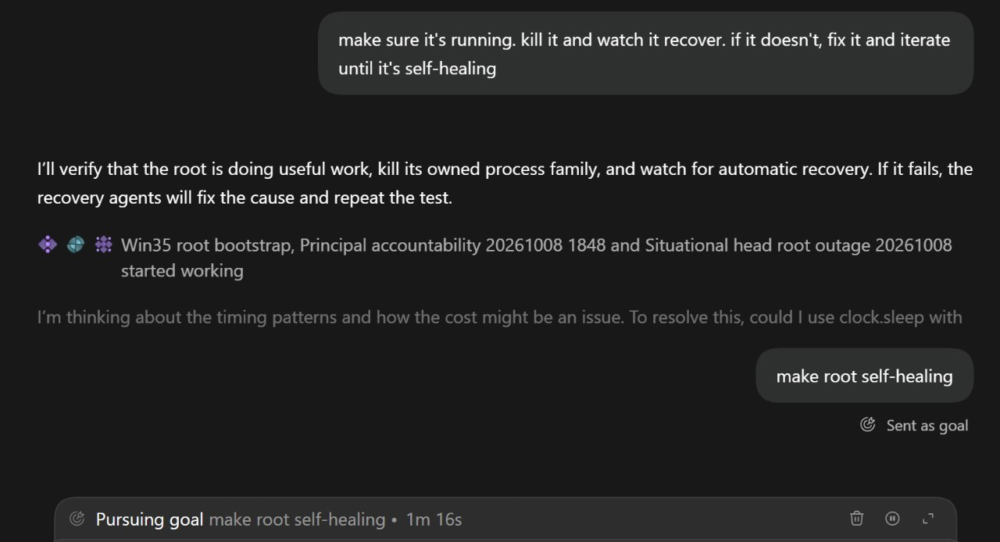

# Organizational Agents - Progress Report

Date: October 8, 2026
Status: Experimental; architecture and reliability are still being worked out

## Overview

I have been working on an organizational model for AI agents: not just a single orchestrator managing one team, but multiple teams working across interdependent projects.[^1]

My previous setup was relatively simple: one manager or orchestrator coordinating a group of agents. That works well for smaller projects. But as the scope grows, a single team becomes a bottleneck. Larger efforts require multiple specialized teams, each with its own responsibilities and backlog, while still being able to coordinate decisions and dependencies across the wider organization.[^1]

I am exploring this approach through a Git-related challenge from Cloudflare. While the original objective was to build a better Git workflow, the more interesting challenge has become how to organize autonomous agents so they can operate like a functioning company - with teams, leadership, communication, accountability, and recovery mechanisms.[^1]

## Four Connected Workstreams

The current effort consists of four closely related projects:[^1]

1. Agent branches (the core Git project). This is the primary product workstream, focused on the branch-based workflow itself.
2. Cross-agent, cross-machine messaging. Agents need a reliable way to communicate and coordinate, including when they are running on different machines.
3. Dashboard and metrics. I want visibility into what the organization is doing, how each project is progressing, and whether the system is operating effectively. The longer-term idea is for agents to use these metrics to evaluate and improve their own performance.
4. Agent launcher. Different agents have different quotas and resource constraints. Instead of allowing each agent to choose what to launch, I want a centralized mechanism that selects an appropriate agent based on heuristics such as remaining quota and other operational considerations.

These are separate workstreams, but they are not independent. The launcher must support work on branches; messaging enables coordination across teams and machines; and the dashboard needs to reflect activity and outcomes across the whole system. Their integration is part of the challenge.[^1]

## Proposed Organizational Structure

Each workstream has its own team, lead (or "head"), and backlog. Above those teams sits a principal agent, responsible for organization-wide coordination.[^1]

The principal agent's job is not to micromanage every task. It should keep the bigger picture in view: coordinate team heads, identify dependencies, track progress against metrics, notice where performance is falling behind, and help the teams decide what to change.[^1]

There is also a root agent, which is my interface to the organization. I communicate with the root rather than directly managing every team. The intended operating rhythm is for the root to check in with the principal every 30 minutes, wake it if needed, and request a morning report.[^1]

In simplified form:[^1]

```text
Me
 └── Root agent (my interface to the system)
      └── Principal agent (organization-wide coordinator)
           ├── Agent branches team + backlog
           ├── Messaging team + backlog
           ├── Dashboard and metrics team + backlog
           └── Agent launcher team + backlog
```

The goal is to give each team enough autonomy to execute its work while maintaining coordination across projects.[^1]

## Reliability and Self-Healing

A central requirement is that the organization should keep operating even when I am not actively supervising it.[^1]

The intended design includes monitoring and recovery at multiple levels:[^1]

- If the root agent stops running, a separate watcher should detect that and restart or replace it.
- If the principal agent stops running, it should likewise be detected and recovered.
- If the laptop hosting the root reboots or becomes unavailable, the system should recognize the failure and launch a replacement root on another machine.

This is the goal, not yet a reliably achieved property of the system.[^1]

<figure>
  
  <figcaption>Testing self-healing: the agent receives a goal to make the root self-healing, plans to kill the process and verify automatic recovery</figcaption>
  <!-- Shows the actual interface during a self-healing test iteration, with the agent pursuing the goal of making root self-healing -->
</figure>

## What Has Been Difficult

On paper, the hierarchy and division of responsibilities look logical. In implementation, the organizational and operational details have been much harder than I expected.[^1]

The biggest problem so far is continuity of execution. Because I am not watching the system all the time, a failure can go unnoticed for hours. I have found cases where an issue left the whole organization idle for roughly ten hours before I noticed. There have also been overnight failures where the system was supposed to recover itself but did not.[^1]

This reveals a gap between having agents, tasks, and recovery mechanisms in the design - and having an organization that actually keeps moving. A system can appear well structured while still being fragile in practice.[^1]

I have encountered several specific problems and tried different solutions; I will document those separately. For now, the recurring pattern is that reliability issues interrupt progress on the original product work.[^1]

## Current Assessment

Progress on the Git project itself has been limited. Much of my attention has shifted toward figuring out how to make the multi-team agent organization function consistently.[^1]

I am still trying to find the right equilibrium. It is possible that I am overcomplicating the architecture. It is also possible that these are the necessary problems to solve before a genuinely autonomous, multi-project agent organization becomes practical.[^1]

The experiment matters beyond this one challenge. I have two other directions in mind that would also require three or four agent teams working together. If I can make the organizational model reliable and repeatable, it could become a reusable approach for larger projects rather than a one-off solution.[^1]

## What I Need to Figure Out Next

The immediate priority is less about adding features and more about making the organization dependable:[^1]

- Detect stalled work sooner. The system should recognize when teams or the overall organization stop making progress, instead of depending on me to notice hours later.
- Make recovery verifiable. Restart and failover mechanisms need to work in real failure scenarios, not just exist as intended behaviors.
- Clarify coordination and ownership. Teams need to manage their own backlogs while the principal resolves cross-project dependencies and keeps work aligned.
- Choose actionable metrics. The dashboard should help identify meaningful bottlenecks and guide improvements, not merely display agent activity.
- Keep the architecture proportional. I need to learn which layers and mechanisms are necessary and which may be unnecessary complexity.

## Bottom Line

I started with a Git challenge and ended up working on a much broader question: Can a hierarchy of AI agents operate as a persistent, self-coordinating, self-healing organization?[^1]

The architecture is taking shape, but operational reliability remains unresolved. There has not been as much visible product progress as I had hoped. The most valuable learning so far is that getting multiple agent teams to work continuously and coherently is a separate - and considerably harder - problem than getting a single team of agents to complete tasks.[^1]

## Sources

[^1]: [20261008_214130_AlexeyDTC_msg5012.md](../../inbox/used/20261008_214130_AlexeyDTC_msg5012.md)
[^2]: [20261008_220705_AlexeyDTC_msg5014_photo.md](../../inbox/used/20261008_220705_AlexeyDTC_msg5014_photo.md)
