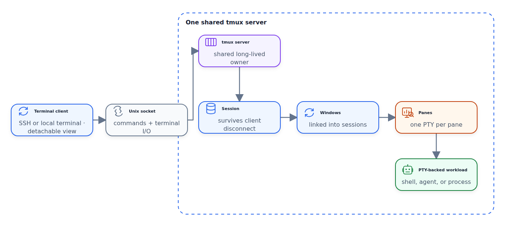
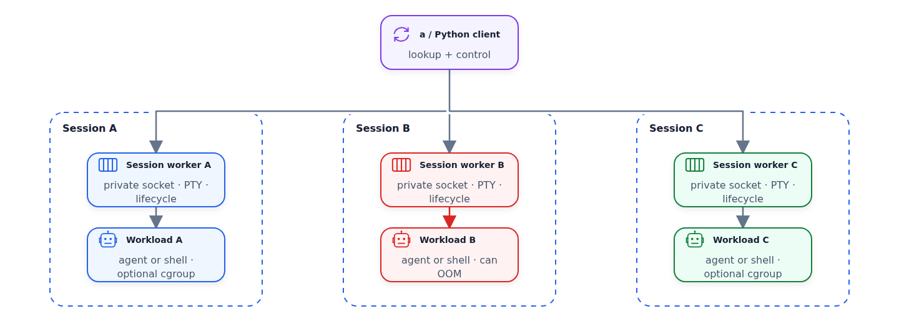

# Why Did I Create My Own Terminal Multiplexer?

I created [aplexer](https://github.com/alexeygrigorev/aplexer) after tmux stopped being the thing I needed most from a terminal multiplexer.

That sentence needs a qualification. tmux remains useful because it keeps terminal programs alive on a remote machine while letting me detach and reconnect later.

My problem changed when the programs inside those terminals became coding agents. I was no longer managing only shells and panes. Each session had an identity and a repository. It also had an engine, a profile, a resource budget, and a lifecycle. I wanted scripts to query those fields.

So I built a different kind of terminal runtime. To explain the choice, I first need to show how tmux works.

## tmux's architecture

The simplest way to think about tmux is as a long-lived server that sits between terminal clients and terminal programs.

When I run something like this:

```bash
tmux new -s project
```

my terminal becomes a tmux client. If a tmux server isn't already running, tmux starts one. The client connects to that server through a Unix-domain socket. The server owns the session and keeps it alive after the client disconnects.

The hierarchy looks like this:

```text
terminal client → Unix socket → tmux server
                                  └─ session
                                      └─ window
                                          └─ pane → PTY → shell or process
```

The [tmux Getting Started guide](https://github.com/tmux/tmux/wiki/Getting-Started) describes the user-facing hierarchy and the detach/reattach flow. The [tmux manual](https://github.com/tmux/tmux/blob/master/tmux.1) fills in lower-level details such as separate client and server processes, sockets, and pseudo-terminals.

A session is the persistent container, and a window is a view inside it. A pane is a region of a window with its own PTY. The shell or program in that pane believes it has a normal terminal. tmux reads from the other side of the PTY, then forwards input and output.

The server owns the sessions, windows, and panes, along with terminal state and client connections. This shared owner gives every client one coherent terminal world.

Commands such as these operate on the same server-managed state:

```bash
tmux split-window
tmux detach-client
tmux attach -t project
```

Detaching only removes the client view. It doesn't stop the shell or the process in the pane. When I reconnect, I get the same session back.

<figure>
  
  <figcaption>tmux puts one shared server in charge of persistent sessions, windows, panes, and their PTYs.</figcaption>
</figure>

This architecture isn't accidental complexity. The shared server gives tmux one place to coordinate terminal layout and state. It also gives tmux a powerful scripting and integration point. The [control mode documentation](https://github.com/tmux/tmux/wiki/Control-Mode/f2a922866c30d367146c5ec24be4f176e0934912), for example, describes a text protocol that lets another program drive tmux without pretending to be a human at the keyboard.

## The case for a terminal multiplexer

The original problem is simple: terminal connections are temporary, but the work inside them often isn't.

An SSH connection can drop, a laptop can close, or a network can change. Without a multiplexer, a long-running command stays tied to that connection unless I add another layer of process management.

With tmux, I can start work on a remote machine and detach from it. I can close my laptop, reconnect later, and continue where I left off.

I can keep several tools running at the same time:

- a shell for commands
- a test runner
- a log tail
- an editor or agent

The terminal becomes a durable workspace instead of a disposable window.

That distinction matters:

- The client is temporary.
- The server and session are persistent.
- The programs attached to the panes keep running.

For a long time, that was exactly the abstraction I needed. A session was a project. A pane was a useful place to run a command. The layout was mostly for me, the human, to look at.

Coding agents changed the requirements, so the terminal became more than a user interface. It became a small runtime for launching and identifying agents, supervising them, and coordinating several processes.

## The mismatch with my workflow

The first mismatch was identity.

I can name a tmux session `project` and a pane `review`, but those names are conventions around a terminal layout. They don't automatically become authoritative metadata for the process running there.

The useful identity of one of my sessions is closer to this:

```text
workspace = /home/alexey/git/project
tag       = review
engine    = claude
profile   = work
```

I wanted to be able to ask for that session directly. I didn't want to remember which pane contained which agent, or depend on a naming convention that another script might interpret differently.

The second mismatch was launch configuration.

Launching an agent isn't always just typing its executable name.

Different engines need their own configuration:

- engine-specific arguments
- profile directories
- permission settings
- environment variables
- working directories

After I repeated these commands often enough, the launch command became part of the runtime configuration.

The third mismatch was resource ownership.

Coding agents are heavier than a few shells. If I run several of them on one machine, memory and process limits become useful controls. I wanted a session to have its own budget and to report what happened when the workload exceeded it.

On Linux, a cgroup is a kernel-supported group of processes to which I can apply resource limits. That was the mechanism I wanted to attach to each session's workload.

The fourth mismatch was the failure boundary.

tmux has one shared server because that's a good way to manage a coherent collection of terminal state. My desired failure unit was different. If one agent session ran out of memory or its supervisor died, I wanted the other sessions to keep their own owners and state.

The fifth mismatch was coordination. Sending bytes to a selected pane is useful, but it doesn't give agents a durable mailbox or a way to recover their identity. I wanted communication addressable by workspace, tag, and engine rather than by whatever layout happened to be visible.

None of these are defects in tmux. I could build conventions, scripts, hooks, and plugins around tmux to cover some of them. I wanted to make the new assumptions part of the runtime.

## The model I wanted

The central idea in aplexer is that a session isn't an anonymous terminal area. It's an identified workload.

The identity is:

```text
workspace + tag + engine + profile
```

`a` is the user-facing CLI, while the longer `aplexer` executable runs each session worker. Every session gets an internal UUID. I can usually find it with a workspace and tag selector instead of copying an opaque identifier.

For example, starting a shell can look like this:

```bash
a start --workspace "$PWD" --tag shell -- /bin/bash -l
a list
a attach --workspace "$PWD" --tag shell
```

An agent session adds the engine and profile to the same model:

```bash
a start \
  --workspace "$PWD" \
  --tag review \
  --engine claude \
  --profile work
```

The configuration supplies the exact launch details. Recording the metadata at session creation matters more than reconstructing it later from a pane title.

That decision drives the rest of the architecture.

## aplexer's runtime architecture

A session starts with the client, not with a shared daemon.

First, `a` validates the tag and canonicalizes the workspace. It resolves the engine and profile, then combines the launch configuration with command-line overrides. It writes a versioned session record to durable state. The record stores the launch identity and configuration. It also stores runtime fields such as process IDs, socket path, phase, and timestamps.

Then the client starts one worker for that session and waits for the worker to become ready.

The worker does the session-specific work:

1. It binds a private Unix control socket.
2. It creates an optional workload cgroup with the requested memory, task-count, CPU, and swap limits.
3. It opens a PTY master and slave.
4. It starts the workload with the PTY slave as its controlling terminal.
5. It keeps the PTY master and reads the workload's output.
6. It serves attach, input, resize, capture, status, rename, and kill operations.
7. It records exit or out-of-memory diagnostics and cleans up when the session ends.

The workload child performs the normal Unix terminal setup:

1. It creates a session with `setsid`.
2. It acquires the PTY slave as its controlling terminal.
3. It connects the slave to standard input, output, and error.
4. It applies the working directory and environment.
5. It executes the configured program.

The worker stays outside the workload cgroup, which limits the agent or shell. This lets it observe the workload, report its exit state, and clean up after a kill.

The core implementation lives in the [session API](https://github.com/alexeygrigorev/aplexer/blob/main/src/api.rs), [worker](https://github.com/alexeygrigorev/aplexer/blob/main/src/worker.rs), [screen tracker](https://github.com/alexeygrigorev/aplexer/blob/main/src/screen.rs), and [messaging](https://github.com/alexeygrigorev/aplexer/blob/main/src/messaging.rs) modules.

The runtime keeps two views of output. It stores a bounded raw history for text tails and feeds the same bytes through a terminal-screen tracker. That tracker reconstructs the current screen of an interactive application. An attach operation can return either view.

The resulting architecture looks like this:

<figure>
  
  <figcaption>aplexer gives each session its own worker, PTY, lifecycle, and optional workload cgroup.</figcaption>
</figure>

Both runtimes have a client and a persistent process.

They differ in who owns the session and where the failure boundary sits:

- tmux's primary abstraction is persistent terminal layout.
- aplexer's primary abstraction is an identified agent or workspace session.
- tmux has one shared server, while aplexer has one worker per session.
- tmux exposes pane-backed PTYs, while aplexer gives each worker its own PTY.
- aplexer can add an optional workload cgroup to each session.
- aplexer exposes structured state, a mailbox, and worker operations.

With three independent sessions, no single worker owns all three PTYs. If the memory limit kills B's workload, sessions A and C keep their own workers and workload boundaries. If worker B dies, session B loses its supervisor, but workers A and C can continue.

That's the invariant I was building toward.

## Features that follow from the architecture

Once identity and ownership live in the runtime, several features become straightforward consequences instead of separate conventions.

Engines and profiles provide consistent launches.

A profile can define:

- the executable and its arguments
- the working directory
- environment changes
- history settings and limits
- permission behavior

Starting an agent becomes selecting a configuration rather than repeating a fragile shell command.

The worker makes identity available inside the workload by injecting `APLEXER_SESSION_ID`, `APLEXER_WORKSPACE`, and `APLEXER_TAG`. The `a whoami` command exposes or recovers that context, so a process can learn its session without reading a terminal title.

The CLI gives me explicit observation through `a list` and `a status`. I can also use `a capture` or `a attach` to look at a session. The state records activity and process information, plus phase, exit details, and resource diagnostics. The worker can provide a current screen for an interactive program or a bounded text history for a log-like view.

aplexer uses a durable mailbox for coordination. Each message is a JSON file in a workspace-specific directory. aplexer writes files atomically and reads them with consumer cursors. Messages can target a tag, reach a whole workspace, filter by engine, or go directly to a pane. The system is pull-based rather than full push, but agents still have a durable place to exchange messages.

aplexer also exposes a transcript surface. It can read native JSONL logs from supported agent tools and return structured events such as messages, tool calls, tool results, and usage. It doesn't copy the entire conversation into aplexer state. It reads the logs where the agent already writes them.

Finally, Python code can call the Rust core through a PyO3 extension. The Python package remains a thin integration layer, while the runtime model stays in Rust.

This is why aplexer is personally better for me.

I can:

- start an agent by identity
- find it by workspace
- look at it after I disconnect
- limit the resources it can consume
- recover its identity
- communicate with it without treating my pane layout as a database

It's a better fit for my workflow, not a universal replacement for tmux. aplexer gives up tmux compatibility and much of the existing ecosystem.

It also leaves out:

- windows and split layouts
- plugins and copy mode

These are real costs.

## My reasons for choosing Rust

I had two main reasons for choosing Rust.

Distribution came first because aplexer is a systems tool. I wanted a native `a` binary without a Python interpreter, a virtual environment, or a second runtime in the critical path. The project also has an optional Python extension for integrations that already use Python.

Rust also fit the implementation because aplexer works close to Unix terminal and process primitives. It gives me direct access to them. Its ownership model helps keep the worker, PTY, socket, and lifecycle state from becoming shared mutable bookkeeping.

I also expected a native binary to have lower startup and runtime overhead than a Python implementation. That expectation influenced the choice, but I haven't turned it into a benchmark against tmux or a comparable Python design. The honest claim is that Rust fits the job and produces a convenient binary, not that I have proven it's faster.

Rust doesn't make systems programming simple. It makes some classes of mistakes visible earlier, while leaving all the real operating-system behavior in place. The project is Linux-focused because PTYs, cgroup-v2, and user-systemd delegation are part of the design.

## The first version came from AI; the working version came from tools

I started by chatting with an AI assistant about the structure of the tool. Then I used GPT Pro to produce an initial Rust version.

That first version was an experiment. It gave me a direction, but it didn't give me a working systems program. The [initial import commit](https://github.com/alexeygrigorev/aplexer/commit/e9ed6c6) even noted that compilation and Python tests still needed verification in the environment.

Next, I compiled the code and ran it, then looked at the failures and wrote tests for the behavior I cared about.

One of the first real problems appeared in the memory-isolation scenario. The worker tried to create a cgroup inside an ambient worker or tmux cgroup and received `EACCES`. I moved the workload into a delegated sibling systemd scope and kept the worker outside it. The [runtime-fix commit](https://github.com/alexeygrigorev/aplexer/commit/2ac9a72) records that change along with the process-startup fix.

Another problem was a process-startup deadlock. I had a parent-child gate for cgroup membership, but `Command::spawn()` waits through the child's `pre_exec` hook before returning to the parent. The parent waited for the child to finish setup. The child waited for a signal from the parent, so the two sides deadlocked.

I changed the design so the child joins the cgroup from `pre_exec` without waiting for the parent to release the gate.

I also redirected worker stderr to a per-session `worker.log`. A worker failure should be visible without mixing its diagnostics into the terminal session it's supposed to supervise.

Those bugs changed the code more than the first prompt did. AI helped me get an initial structure quickly, while compilation and the Linux environment exposed issues. Logs, runtime experiments, and failure tests showed which parts of that structure were wrong.

The generated version was a Rust hypothesis, not the implementation.

## Current verification

In the current checkout, the ordinary Rust test suite passes.

It covers:

- 61 library tests
- 37 CLI tests
- the non-destructive start/attach/send/capture round trip
- three screen snapshot tests
- three transcript tests

The repository also contains tests for three-session OOM isolation and worker-kill isolation. The test runner currently ignores them because they need a suitable user-systemd session and cgroup-v2 delegation. I treat them as important scenarios that still need to run reliably in the target environment. Passing them wouldn't prove identical behavior on every Linux setup.

That distinction is part of the project too. A terminal runtime that manages processes and memory needs tests for the failure cases, not only tests for the happy path.

## Conclusion

I didn't create a terminal multiplexer because tmux is bad. I created one because the unit of work had changed.

tmux models persistent terminal topology. Its shared server keeps a hierarchy of terminal contexts alive. That model supports shells and long-running commands well.

My workflow needed a runtime that modeled an identified agent session. It needed workspace, engine, profile, and resource-boundary metadata. It also needed observable state and session-to-session coordination.

aplexer is my smaller, more specialized, Linux-specific attempt to make that model explicit, and it's still evolving. I don't think everyone should replace tmux. I built it because a familiar tool can solve the old problem so well that a changed workflow reveals a new one.
