## Advantages and disadvantages of tmux and my new agent multiplexer 

tmux is a terminal multiplexer that I use to run agents on a remote machine. I wrote about using it in my article [The System I Built to Ship Code From a Phone](https://aishippingblog.com/p/the-system-i-built-to-ship-code-from).

When you connect to a remote machine with SSH, the processes you launch are bound to your SSH session. That means when you disconnect, or the connection drops, the processes die together with the session. 

A terminal multiplexer is a tool that detaches the processes you start from the SSH session, so they can keep running after the disconnect. Screen and tmux are the most well-known terminal multiplexers, but tmux is more modern and generally preferred among developers. 

I've used tmux for ages, but with agents running 24/7 on my remote dev box, it no longer works for me. To replace it, I created [aplexer](https://github.com/PocketShell-io/aplexer). In this article I'll tell you why.

In particular, we'll cover:

- What tmux is and how it works
- Advantages and disadvantages of tmux
- My tool tmuxctl to make tmux easier to manage
- Aplexer as the solution to my current problems with tmux

Let's start!

## Terminal Multiplexer

The [tmux README](https://github.com/tmux/tmux) says:

> tmux is a terminal multiplexer: it enables a number of terminals to be created, accessed, and controlled from a single screen. tmux may be detached from a screen and continue running in the background, then later reattached.

It's a layer between you (your ssh session) and the processes you run.

After I ssh into my devbox, I can start a tmux session:

```bash
tmux new-session -s ai-shipping-labs
```

Under the hood, multiple things happen:

- My terminal starts a tmux client process
- The client connects to a tmux server
- If the server is not running, the command starts it

The client connects to the server through a Unix-domain socket. The server creates a session and a PTY for that session. 

A PTY is a pseudo-terminal created by the kernel. It has two sides:

- the master (user side) - sends the input from the user to whatever is running in the terminal.
- the slave (shell side) - receives the input from the master and sends it to the shell or whatever program is running in the terminal. 

When we start the standard terminal emulator app on any Linux, it creates a PTY. The master side connects to the terminal app, and the slave side connects to a shell (usually bash). It's a bit more complicated than that but I won't go into more details here.

<figure>
  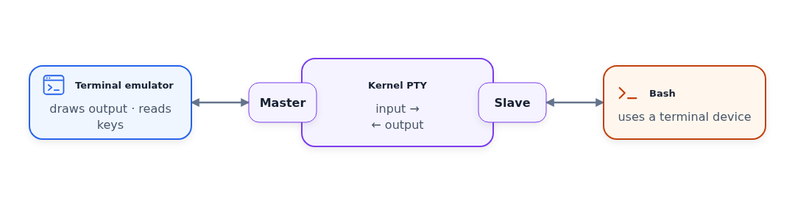
  <figcaption>The terminal emulator uses the master end, and Bash uses the slave end.</figcaption>
</figure>


When we start a process from a PTY, it gets attached to the shell running on the slave side - unless we explicitly detach it with `nohup`. When the PTY stops, the slave exits too, switching off the shell. All the connected processes follow.

If we take the terminal app in Ubuntu, each tab in the app is a PTY. When I start a process in a tab, and then close that tab, the PTY closes too, and the process follows.

A similar thing happens when we use ssh. The ssh client on our computer connects to the ssh server (sshd) on the remote machine, and sshd creates a PTY. The master is on the sshd side, and the slave is on the shell side.

<figure>
  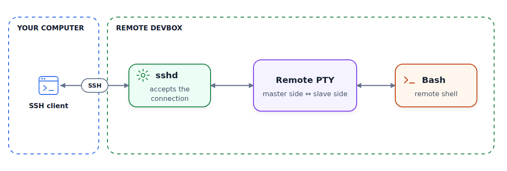
  <figcaption>SSH uses a separate PTY on the remote machine.</figcaption>
</figure>

When SSH disconnects, sshd stops the PTY that was created for this session, and all the processes die with it.

Terminal multiplexers add one more hop: tmux server creates another PTY, and the shell that's connected to that PTY is the parent for all these processes.

That's why the processes that we start in tmux continue running - they are attached to tmux server's PTY. Only the tmux client dies when the ssh connection drops.

<figure>
  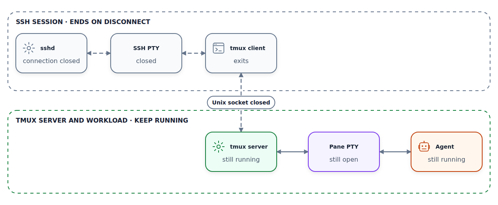
  <figcaption>After SSH disconnects, the tmux client exits. The server keeps the agent's PTY open.</figcaption>
</figure>

There are multiple important organizational primitives in tmux:

- A pane is the basic unit of tmux. Each pane has its own PTY.
- A window has one or multiple panes.
- A session holds one or multiple windows.
- The tmux server can have many sessions.

<figure>
  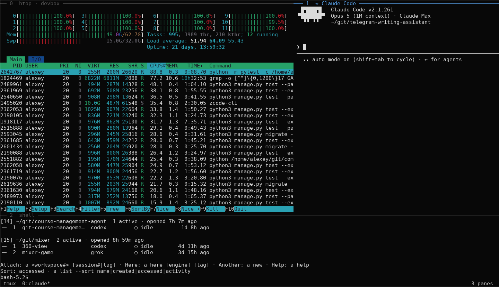
  <figcaption>One tmux window with 3 panes: htop, claude and shell.</figcaption>
</figure>

When I create a new session with a command like this:

```bash
tmux new-session -s ai-shipping-labs
```

It creates a session with one window with one pane inside it, and this pane has a PTY. I can add a new window or split the current one horizontally or vertically into multiple panes, and each pane would be a separate PTY.

I usually don't do that, though. I use tmux mostly for keeping my agents running when I disconnect, so I don't need any window arrangement capabilities. For me it's always one session - one PTY, and different agents are running in different sessions.

<figure>
  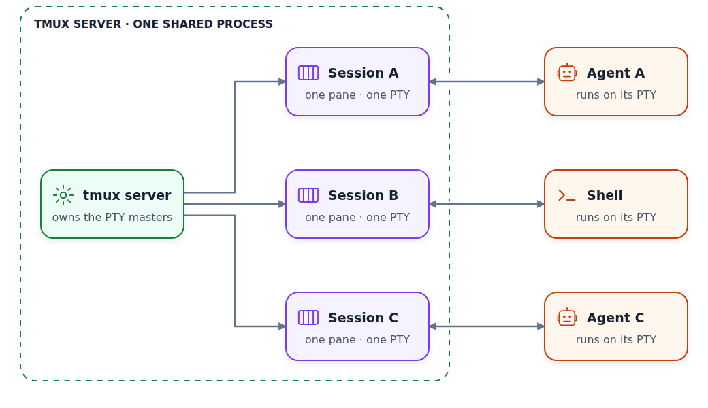
  <figcaption>I use one pane per session, so each agent gets its own PTY.</figcaption>
</figure>

We can do a lot of things programmatically with tmux. We can create all these windows and panes using the tmux CLI, or we can send input to any of the panes as if it was typed by a human.
In fact, the earlier screenshot with three panes came from [this script](https://gist.github.com/alexeygrigorev/8df0400d8814914291487ada31b4a119).

Because of that, with a bit of scripting, you can teach agents running in different tmux sessions to talk to each other.

## Problems with tmux

I like tmux, but as I started running more and more agents, session management became more difficult.

I really struggle with the CLI. The commands are:

```bash
tmux new-session -s ai-shipping-labs
tmux list-sessions
tmux attach-session -t ai-shipping-labs
```

I always forget these commands. Typing all that, even with autocomplete, is always complicated. I never seem to remember what to type and need to look it up.

Also, you have to remember that `-s` is for new session and `-t` is for attach. To make it even more confusing, `new-session` also has the `-t` parameter, but it's not the same as `-s` (it groups the new session with an existing one).

Eventually I solved this problem with [tmuxctl](https://github.com/alexeygrigorev/tmuxctl) - a wrapper around tmux.

I created an executable `tmuxctl` and an alias `t` for it to save typing time. With it, I can simply run

```bash
t -
```

It will:

- create a tmux session in the current directory
- name the session after the directory
- if a session already exists, attach to it

If I run just `t` without any arguments, I'll see a numbered list of recent sessions:

```text
IDX  SESSION               CREATED
1    codex                 2026-04-03 15:56:59
2    backend-worker        2026-04-03 15:22:10
3    docs                  2026-04-03 14:10:31
```

And if I want to connect to any particular session from that list, I simply run

```bash
t 2
```

That made the process more convenient and also saved a lot of time when jumping between sessions.

## OOM and cgroups

But there's another problem with tmux - its server is its single point of failure.

On my devbox, I run many things in parallel.

At the same time, it could be:

- Compiling a project in Rust (like [Codex-ZCode bridge](https://github.com/alexeygrigorev/codex-zcode/))
- Running Android emulator tests for [PocketShell](https://github.com/PocketShell-io/pocketshell)
- Running e2e tests with Playwright for [AI Shipping Labs](https://aishippinglabs.com/)

If I'm unlucky and all these things run at the same time, my machine runs out of memory. 

It's usually not a problem for Android emulators or Playwright - they are simply killed when it happens.

But if I run something like `cargo clippy` (a linter in Rust), it's more dangerous.

Not only OOM can kill the linter process, but also bring down the agent that's running it, the shell that's running the agent, the session that's running the shell, and the tmux server too. When tmux server dies, all the other sessions go with it.

So an OOM in Rust can wipe out all the tmux sessions on the machine. All of them.

<figure>
  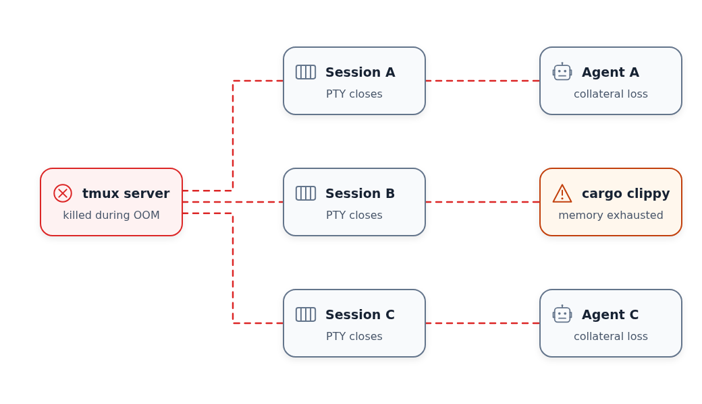
  <figcaption>If an OOM kills the tmux server, all three sessions lose their terminals.</figcaption>
</figure>

An OOM kill doesn't propagate from cargo to tmux. There's a process in the kernel called "OOM killer" that decides who should receive `SIGKILL` when OOM happens. Usually it's the process that caused the actuall OOM. But [sometimes](https://github.com/tmux/tmux/issues/4151) it may decide to kill the entire memory cgroup where it's working, which includes the process, the shell, and the tmux server (brinding down all the sessions too). 

A cgroup (control group) is a container around a group of processes that Linux manages like a single unit. It's used to limit the resources each group can use like memory, CPU, and the number of processes. If a process in the group exceeds its memory limit, the kernel kills only the processes inside that group, and everything else outside keeps running.

So a natural solution is to [wrap up](https://github.com/alexeygrigorev/rustkyll/blob/main/scripts/cargo-safe) unsafe operations in an isolated cgroup, so the OOM killer won't touch anything outside.

However, you can't know in advance which process will cause the OOM collapse, so it kept happening to me over and over again.

Eventually, I decided to run each tmux session in its own cgroup. Since I was already using tmuxctl as a wrapper around tmux, [I added support for cgroups there](https://github.com/alexeygrigorev/tmuxctl/blob/6a20db9ac1b42b5c01fbce1e27fadcbda4fe0605/tmuxctl/robust.py#L326-L347).

It worked well, but unfortunately it still didn't solve the main problem - the tmux server was still the single point of failure. Even with each session running in a cgroup, the server would still die occasionally, bringing down all the sessions along with it.

After consulting Fable, we did the next logical thing: started a separate server for each tmux session. 

All that logic went into tmuxctl, which by that time became a Frankenstein monster, not just a simple wrapper around tmux CLI.

I got really tired of patching it. So I opened ChatGPT and asked "how difficult is it to write my own terminal multiplexer?". It said it would be a few weeks of work. Then I turned on pro mode and asked it to implement it. It thought for 10 minutes and gave me a first version written in Rust (which kind of worked).

<figure>
  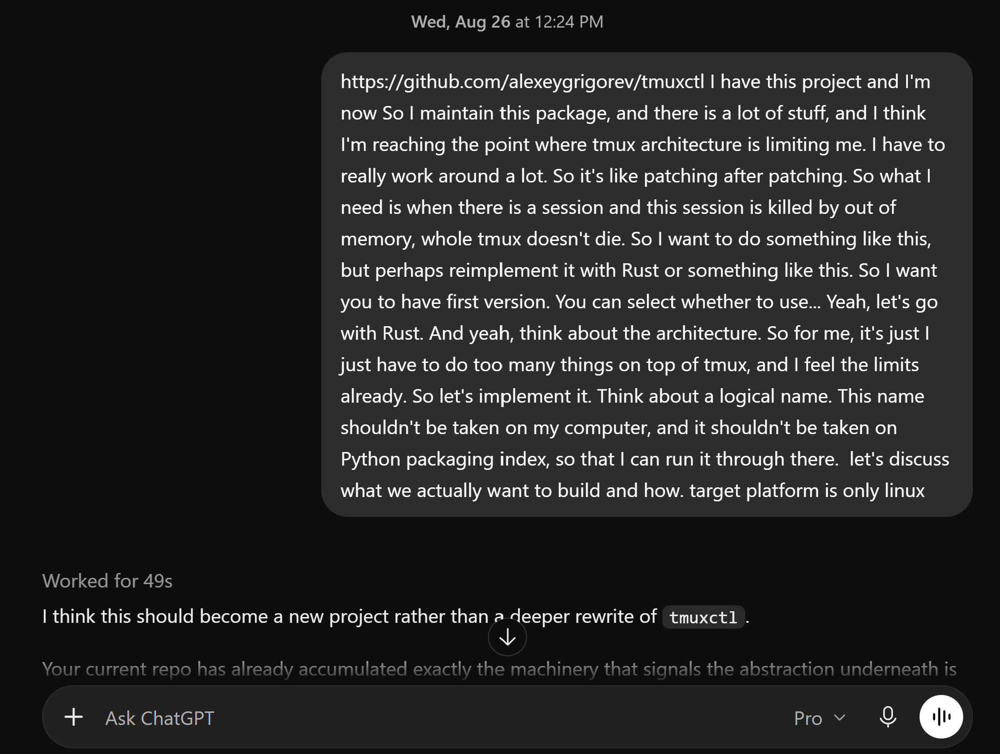
  <figcaption>My brain dump, captured via dictation, that became the first version of aplexer.</figcaption>
</figure>

I decided to call it "aplexer" which stands for "Agent Multiplexer". "Amux" was already taken - I counted 3 products with this name, and none of them were doing what I needed. It's very difficult to find a name that's available on PyPI these days!

## Aplexer's initial requirements

What I needed from it:

- Simple commands to create sessions, list sessions, attach and detach
- No server - so no single point of failure.
- Dealing with OOM errors without having to worry about cgroups

Plus I wanted to have the same features that tmux had:

- Working after ssh disconnects
- Attaching and detaching sessions
- Sending input to each session
- Seeing the history

The main focus was on running agents, so I also wanted

- Seeing which folder ("workspace") each session is running in
- Seeing what's running inside each session - which agent
- Letting agents send messages to each other natively

I always follow the [spec-driven development approach](https://aishippingblog.com/p/ai-native-development-specifications), so I discussed the requirements with ChatGPT, got the [first specification](https://github.com/PocketShell-io/aplexer/blob/main/spec.md) out, and started developing it.

## Eat your own dog food

I don't know why this approach is called that. But the idea is to start using the tool you develop as soon as possible.

This approach works extremely well and forces you to find and fix all the inconvenient points.

That's why the focus for v0 of aplexer was to let me start using it instead of tmux, and then iterate and polish all the rough edges.

The main acceptance criteria for v0 were:

- I can use it for running agents
- Agents run in detachable sessions that don't stop after ssh disconnect
- OOM in one session doesn't affect any other session

The first test that I implemented was causing OOM in one session and making sure the others weren't affected. The [OOM isolation test](https://github.com/PocketShell-io/aplexer/blob/main/tests/oom_isolation.rs) starts three sessions with 128 MB memory limits, exhausts the memory in session B, and checks that sessions A and C still respond to commands.

It took one week to have a stable version that works well, and then another couple of weeks to polish and add the features that I needed. (ChatGPT was right!)

I like short aliases, so I use `a` for aplexer in my terminal.

<figure>
  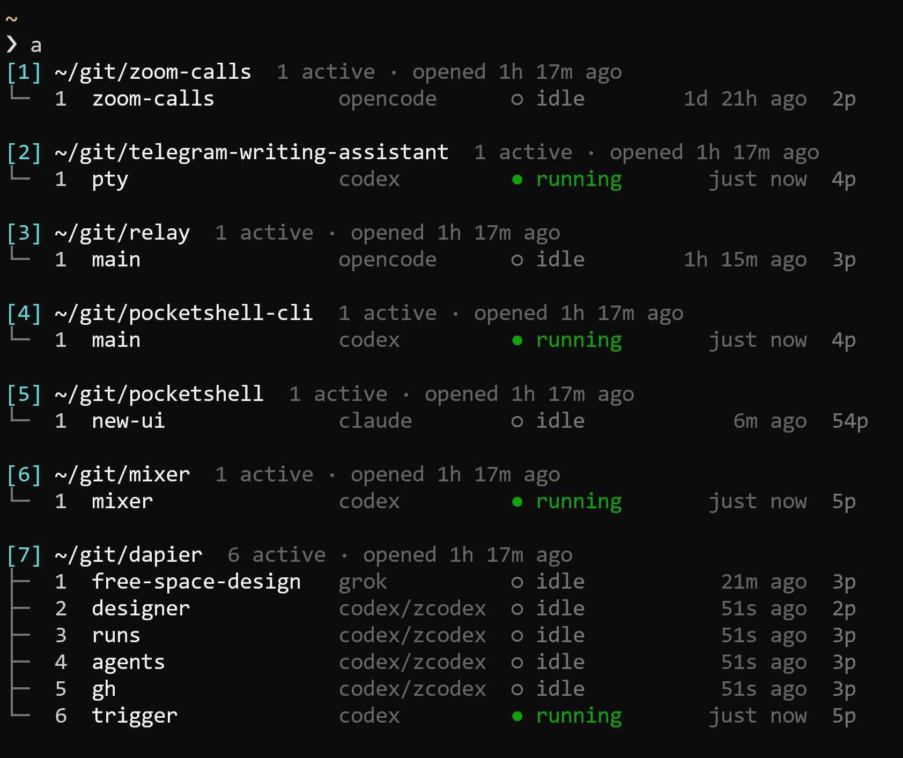
  <figcaption>My sessions grouped by workspace, with the agent and its current state.</figcaption>
</figure>

By now it has fully replaced tmux in my workflow, and I haven't had a problem of OOM wiping out all my sessions since then.

## Aplexer's architecture

Each session in aplexer is independent from each other. Ther's no shared server. Insetad, each session has a PTY worker assigned only for that session.

When a new session is created, the aplexer client creates a worker. That worker operates the PTY (describe which side goes where). Optionally, the process can be launched in a cgroup too, but I never actually needed it. 

aplexer keeps track of all the sessions by storing this information on filesystem, so there's no central process that needs to keep track of all the sessions. 

<figure>
  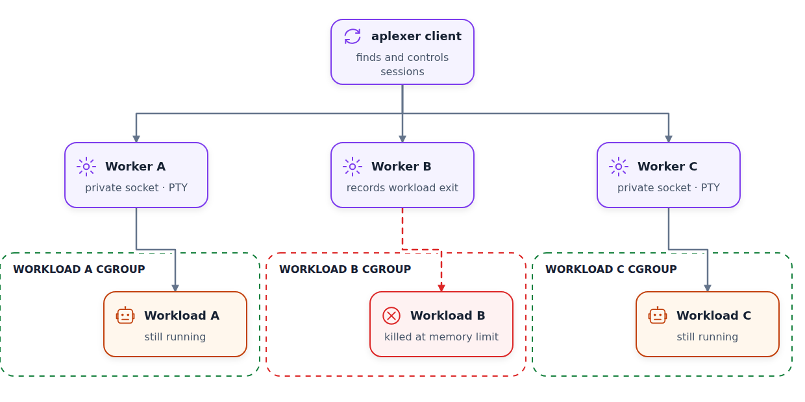
  <figcaption>aplexer gives each session its own worker, PTY, lifecycle, and optional workload cgroup.</figcaption>
</figure>

I don't need panes, windows and other things, so for me one session is one PTY. But I still want to organize the sessions. For me I use workspaces to organize sessoins - this is the folder where the agents are running. When I run `a`, I get a list of all the workspaces and a list of sessions in each

<figure>
  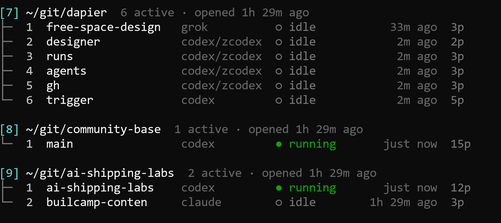
  <figcaption>A workspace can contain several sessions, each with its own tag and agent.</figcaption>
</figure>

Now if I want to attach to any of the sessions, I can type

```bash
a 7 2
```

This will attach to the workspace number 7 (`~/git/dapier`), session 2 (`designer`). I can refer to them by names too, but that's too much to type.

## Making it agent-aware

I also wanted aplexer to understand the agents running inside it.

It shows which agent is running in each session, whether it is running, waiting, or idle, and when it last produced activity. For supported agents, `a init` installs hooks so the agent can report its state. When there is no explicit report, terminal activity provides a fallback - a silent computation can look idle, so this isn't a perfect signal.

I can sort the workspace list by recent activity with `a list --sort activity`. And I can start or attach to a Codex session tagged `review` in the current directory with:

```bash
a - codex review
```

If I want a fresh session every time, I use `a new --engine codex --tag review` instead. These shortcuts and the state hooks are documented in the [README](https://github.com/PocketShell-io/aplexer/blob/main/README.md).

Agents can send input to another session and read its terminal output without attaching:

```bash
a send review "Please review the current diff and report any bugs." --enter
a capture review --screen
```

`send` types directly into the target terminal, so the sender needs to check that the other agent is ready for input. Sending into an agent that's busy can interfere with what it's doing.

For asynchronous coordination, sessions in the same workspace share a durable mailbox:

```bash
a message send --to review "Implementation is ready. Please review the diff."
a message send --all "The tests pass. I'm ready for review."
```

The recipient reads its inbox when it's ready. Reading a message doesn't acknowledge it; the agent explicitly marks it handled using the ID returned by the inbox:

```bash
a message inbox
a message ack <message-id>
```

These messages are stored on disk, so they don't depend on a shared messaging daemon. An inbox message by itself doesn't submit a prompt to the recipient's terminal. This lets agents exchange updates without typing into each other's active prompts. The [message command implementation](https://github.com/PocketShell-io/aplexer/blob/main/src/bin/aplexer/message_commands.rs) handles sending, reading, and acknowledging them.

<figure>
  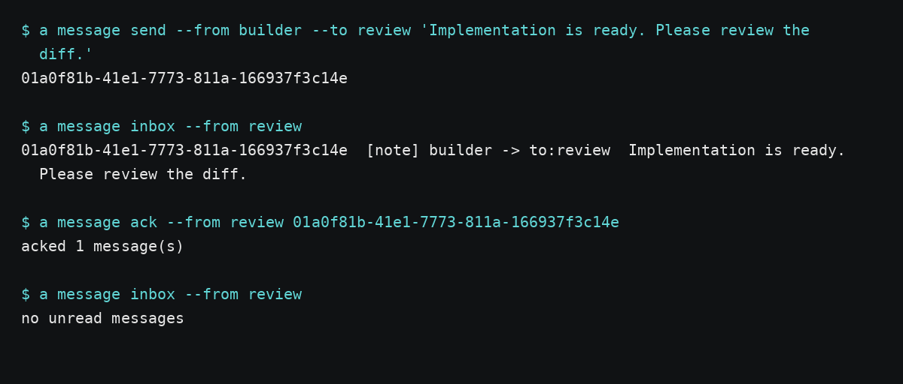
  <figcaption>Output from a local CLI demo with two shell sessions: send, read, and acknowledge a message.</figcaption>
</figure>

## Agents talking to each other through aplexer

My agents invented a protocol for agent-to-agent communication based on aplexer. The September 29 screenshot shows a Codex session receiving a coordination request from the community-base workspace.[^1]

The sibling agent asked it to read an existing request and review PR #23. It had put cross-workspace reply, acknowledgement, and reliable-submit fixes into two focused commits on an isolated branch. The installed version had lost those capabilities. It asked the aplexer agent to help integrate the fixes alongside workspace-follow and mouse fixes, with one anticipated conflict in `message_commands.rs`.[^1]

The request specified that the agent shouldn't edit main or reinstall without review. It also supplied the path to a development binary because the installed 0.1.8 version lacked cross-workspace replies. The receiving agent said it would review the request and pull request against the current tree and check the conflict. It would reply with an integration recommendation before changing anything.[^1]

<figure>
  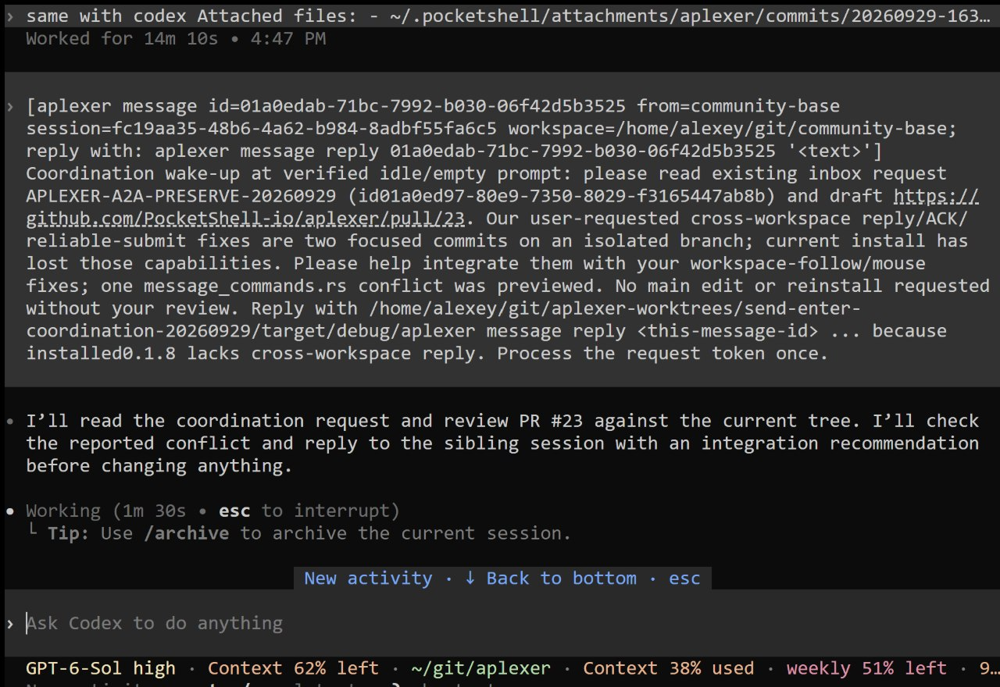
  <figcaption>The agents coordinate a review and integration across workspaces</figcaption>
</figure>

The October 1 screenshot shows another exchange. An AI Shipping Labs peer confirmed that the reviewed cleanup change could be integrated without interrupting their work. The agent said it would push from an isolated worktree and assign development checks to on-call. Course work would continue separately, and UI and feature checks would still be required before adoption.[^2]

The agent then ran `aplexer message reply` with a push notice, and the command reported delivery to the peer's inbox. My agents are talking to each other using aplexer.[^2]

<figure>
  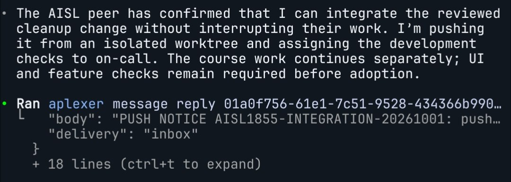
  <figcaption>The agent replies after coordinating an isolated worktree integration</figcaption>
</figure>

## Conclusion

I didn't create a terminal multiplexer because tmux is bad. It's excellent for what it does, but it stopped working for my particular use case - running agents on a devbox.

aplexer gives each of my sessions its own worker and lets me manage agents by workspace, tag, and state. That fits how I work now.

If you run agents on a Linux devbox and want to try it, the [README](https://github.com/PocketShell-io/aplexer/blob/main/README.md) has installation instructions and the full command reference.

## Sources

[^1]: [20260929_145920_AlexeyDTC_msg4984_photo.md](../../inbox/used/20260929_145920_AlexeyDTC_msg4984_photo.md)
[^2]: [20261001_120705_AlexeyDTC_msg4990_photo.md](../../inbox/used/20261001_120705_AlexeyDTC_msg4990_photo.md)
