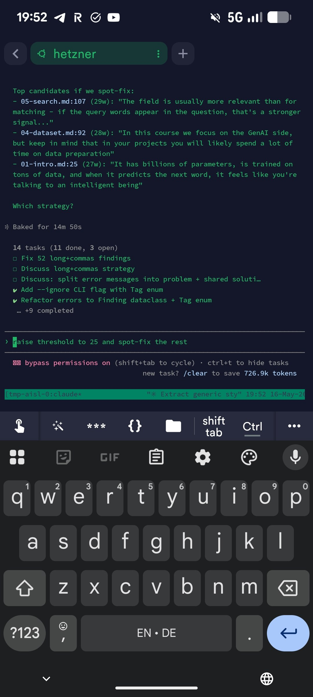
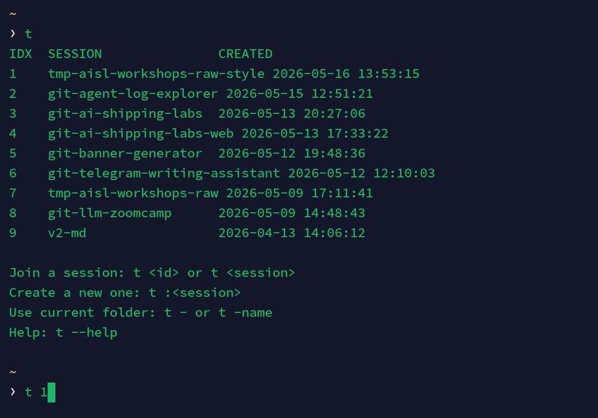
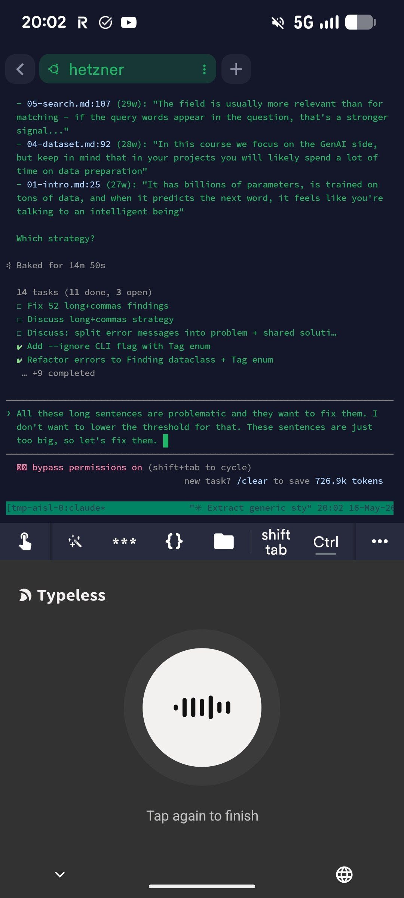
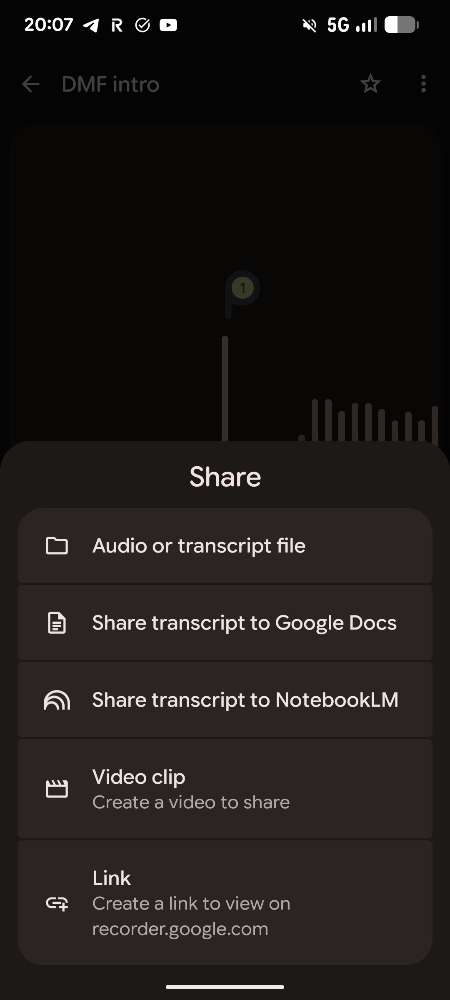
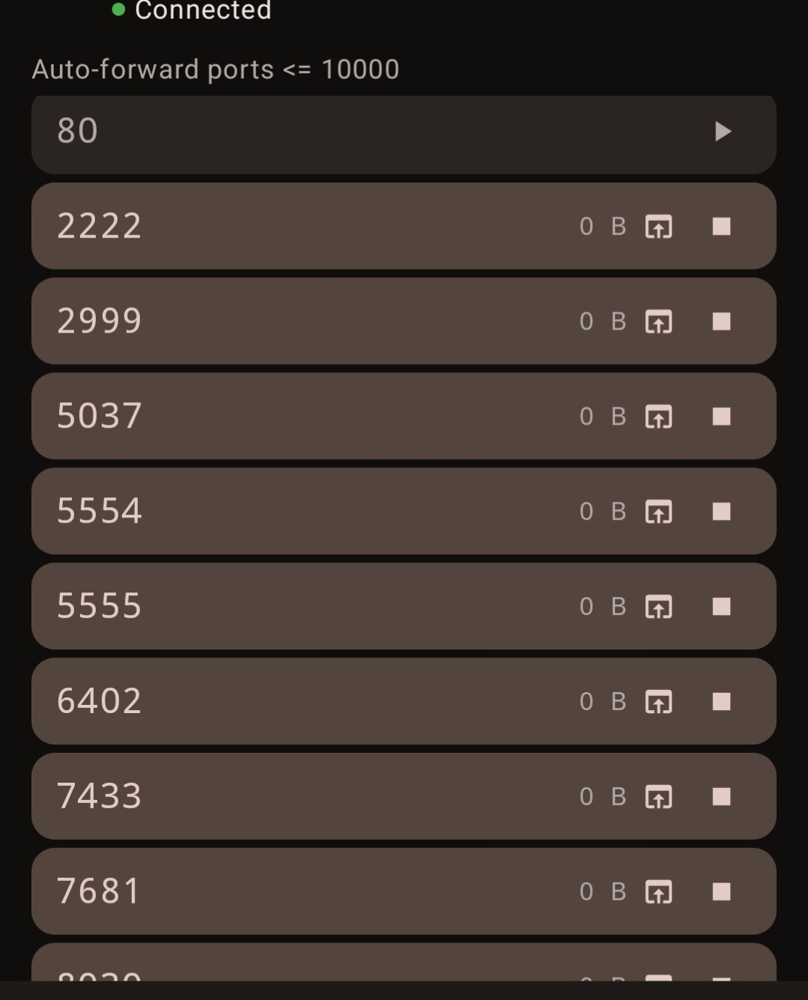
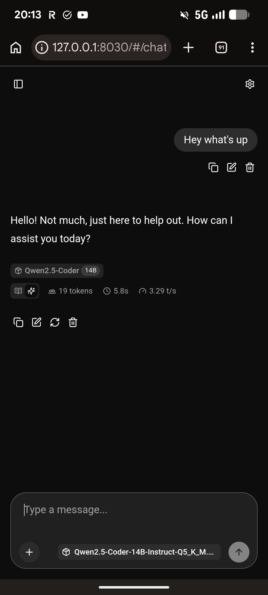
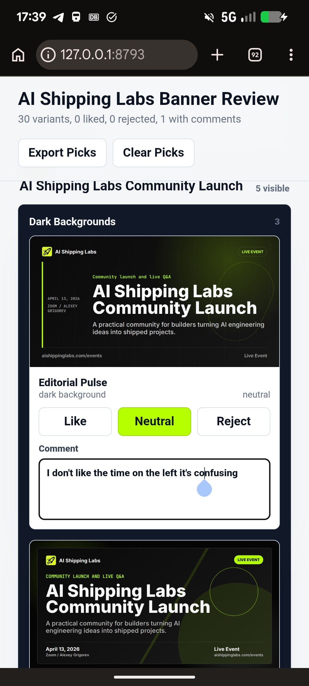
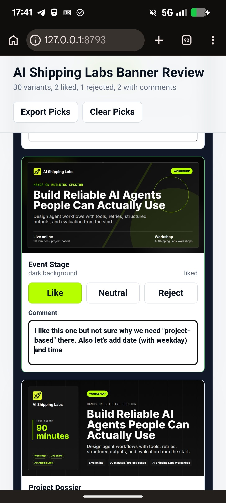
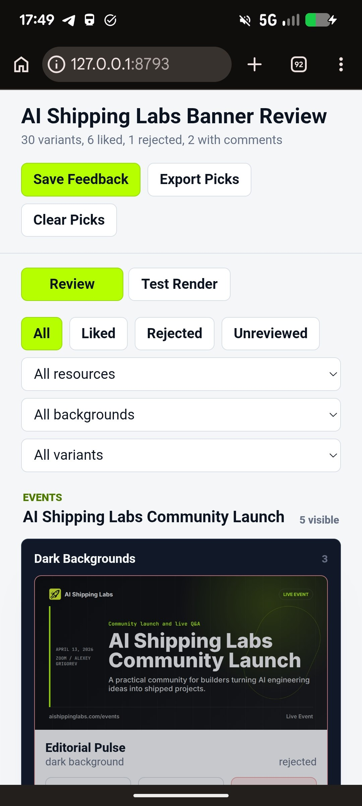

# Working from a Phone

Lately I have been on three conferences in a row: first Darmstadt, then Amsterdam, then Porto. The work does not slow down for any of that, so I have to keep things moving.[^1][^2][^3][^29]

On top of the conferences, I have been travelling with my child a lot. We went away during the Easter holidays. May 1st was a long weekend in Germany. And I am dictating this just after we got back from another long weekend, around 14-15 May - we drove to Stuttgart and into the Schwarzwald (Black Forest).[^29]

My day-to-day schedule is uneven on its own. I take my child to school in the morning, I go to the gym, I have lunch meetings, I pick the child up at 4 PM. Between all those slots I have lots of commute time, plus the rest periods between sets in the gym - every set leaves me with a free minute or two.[^17][^29]

I want to use all of that in-between time, because I have too many projects on the go - the AI Shipping Labs site alone takes a lot of work - and I want them to actually progress.[^17]

This article is about how I work from the phone during all of this dead time: trams, school runs, gym rest periods, planes.[^1][^17]

<figure>
  
  <figcaption>A Claude Code session on the phone, mid-task</figcaption>
  <!-- Sets the visual baseline for the rest of the article: this is what "working from the phone" actually looks like -->
</figure>

## A dedicated remote server

I used to write a lot of code from a tram by leaning on GitHub Copilot - I wrote about that flow earlier in [Shipping Features from my Smartphone with GitHub Copilot](https://alexeyondata.substack.com/p/shipping-features-from-a-tram-stop). Under the hood that was GitHub Actions doing the work for me. It was a kind of "remote environment", but not one I owned - it was GitHub's runtime that I borrowed for each task. That has changed in the last few months. I now have a full dedicated Linux server on rent, running 24/7, and I use it for everything described here. I connect to it over SSH and on it I can install whatever I need - Claude Code, Codex, OpenCode - and they all live there.[^4][^29]

On Android I use a client called Termius. I just SSH into the server through it and run whatever I want.[^5]

## tmuxctl: simplifying tmux

Because I am connecting remotely and might be on the move, I always need tmux so my sessions do not drop. I create a tmux session and the agents live inside it.[^5]

Once I started using tmux heavily, I realised typing tmux commands from a phone is painful. The usual flow is `tmux new-session -s some-long-session-name` or `tmux attach -t some-long-session-name`. You can imagine that with long session names, this is essentially impossible to write from a phone. So I built [tmuxctl](https://github.com/alexeygrigorev/tmuxctl) to make this fast:[^5][^6][^7][^29]

- `t` lists all sessions
- `t 1` attaches to the session with index 1
- `t -` creates (or attaches to) a session named after the current folder
- `t -web` adds an alias suffix - so in the same folder I can have a code session and a `-web` session running `make dev`

I also lean on Makefiles heavily. From a phone I cannot type long commands, so I keep everything behind a `make dev` style target. I used Makefiles before, but the phone makes them non-negotiable.[^8]

<figure>
  
  <figcaption>`t` listing all current sessions on the server, ready to attach by index</figcaption>
  <!-- Shows the actual session picker - the part of the workflow that replaces typing long tmux commands -->
</figure>

I know things can be more touchscreen-friendly than this and I have ideas for improving the terminal experience further, but for now this is what I have.[^8]

## Three agents, three aliases

Inside the session I run agents. I use three of them. Claude Code more and more, Codex when Claude limits run out, and OpenCode after that. None of them are new to me, I have been using all three for a while.[^9]

I have aliases for all three:[^10][^11]

- `csp` - Claude with skip permissions
- `cy` - Codex YOLO
- `oc` - OpenCode

When I want to start a session, I just type two or three letters. Usually the sessions are already running - I tend to start them from my computer ahead of time - so from the phone I just attach and do something inside.[^11]

I know "skip permissions" and "YOLO" sound reckless, and I am aware of the risks. They are acceptable for me because of how this server is isolated. The server itself has no access to production. The Hetzner deployment box is reachable only from my laptop, so a runaway agent on this server cannot push changes anywhere. If an agent does something destructive, the radius is limited to this one machine - and I can rebuild it easily from my bootstrap instructions. That isolation is what makes the bypass modes safe for me to use here.[^29]

## Portable setup via dotfiles

The aliases and configs are not living on a single machine - they come from my dotfiles project at [github.com/alexeygrigorev/.claude](https://github.com/alexeygrigorev/.claude). I install that project on a machine and it sets up all my aliases automatically. The same dotfiles run on my laptop, my tablet, and my remote server, so the configuration is identical everywhere - all managed through Git. If I ever move to a different machine, one command brings back all my settings for Claude Code, Codex, and OpenCode. That same setup is also what I rely on when restoring the remote server from scratch.[^11][^29]

The dotfiles repo also has skills.[^12]

## Typing by talking: Typeless and Google Recorder

Even with short aliases and tmuxctl, typing on a phone is painful, especially when I want to give an agent a real task. I solve this in two ways.[^12][^13]

First, I use a special Android keyboard called Typeless. I enter the Claude Code session, switch the keyboard into dictation mode, talk into the phone, and it turns my stream of thought into properly structured text - not just a transcript, but something that reads like a written message. The result lands directly in the agent.[^12][^13]

<figure>
  
  <figcaption>A long prompt dictated into Claude Code via Typeless, ready to send</figcaption>
  <!-- Illustrates how Typeless restructures a brain dump into a coherent prompt before it reaches the agent -->
</figure>

There are two problems with Typeless. I am still on the free version - I already pay for too many things and have not been ready to add another subscription - so I hit usage limits. When that happens I fall back to Android's built-in voice recognition, which is, to put it mildly, not great. With a terminal it gets confused. Agents still mostly understand what I mean, but it is not ideal.[^13]

When the built-in recogniser is not good enough, I switch to Google Recorder. On the phone I open Google Recorder, record what I want to say, then tap Share and create a public link. I send that link to the agent.[^13][^14]

<figure>
  
  <figcaption>Google Recorder's share menu - I use "Create a link to view on recorder.google.com" to hand the recording to the agent</figcaption>
  <!-- Shows the exact entry point for the recorder-to-agent flow described in the text -->
</figure>

I have a skill that knows what to do with a recorder link. It downloads the audio file from there and transcribes it. The skill recognises when a link is from Google Recorder and runs the transcription path.[^14]

A big advantage of Recorder is that it keeps recording when it is in the background. Right now I am recording this very article while the app is minimised. Later I will hand the recording to my Telegram writing assistant, which will turn the notes into a readable text I can edit.[^15]

## From a recording to GitHub issues

Once a recording is transcribed, I can hand it to my orchestrator agent. The orchestrator takes the recording, decomposes it into GitHub issues, and starts working on them.[^16]

This is especially useful when I want to give feedback in the background. I open the AI Shipping Labs site on my phone, start using it, and as I find issues - "I do not like this", "this does not work", "this should be different" - I record them as I go. I end up with a 20-30 minute file. I send that file to the agent on the phone, and the agent transcribes it, decomposes it into issues, and starts work.[^16]

The same approach works on a plane. On a plane I obviously cannot SSH anywhere. So I run a local version on my own laptop, then take the phone and record feedback into Google Recorder. Recorder works offline. When I leave the plane and turn off airplane mode, I push the recordings to the agent and it does the work from there.[^18]

## ssh-auto-forward-android: port forwarding from the phone

The last awkward thing about phone work is port forwarding. The Android apps for SSH port forwarding are not great. I already had a tool I love on the computer side - a Python program I described in [5 Useful Utilities I Built with AI Coding Assistants](https://alexeyondata.substack.com/p/5-useful-utilities-i-built-with-ai), [ssh-auto-forward](https://github.com/alexeygrigorev/ssh-auto-forward) [^19], which watches the ports that open on the remote machine and automatically forwards them to localhost. It runs on the computer, in Python.[^19][^29]

I needed the same thing on the phone, so I gave the task to one of the agents - I think OpenCode in this case - and asked it to port the thing to Android. The result is [ssh-auto-forward-android](https://github.com/alexeygrigorev/ssh-auto-forward-android), written in Kotlin. I have not actually looked inside it, just like I never really looked inside the Python version - I do not even know what is in there. But it works the way I need it to.[^19][^20]

The flow is simple. I open the app, hit Connect, it connects, and I see the list of remote ports being auto-forwarded.[^21]

<figure>
  
  <figcaption>The Android app listing the ports it is forwarding from the remote server to localhost</figcaption>
  <!-- Shows what "Connected" looks like in practice - the list of live forwarded ports the user can tap on -->
</figure>

When I tap a port row, the browser opens and goes straight to that port on localhost.[^22] In the screenshot above, port 8030 is `llama.cpp` running on the server. Tapping that row drops me into the chat UI.[^23]

<figure>
  
  <figcaption>Talking to a Qwen2.5-Coder 14B server (llama.cpp on port 8030) after tapping the forwarded-port row</figcaption>
  <!-- This is the payoff of the previous screenshot - one tap on the port row and the browser is on localhost talking to the model -->
</figure>

## Looking at things the phone cannot show

Another phone limitation is that I cannot really browse the file system. I can use SFTP, but it is awkward, and sometimes I need to see something visually - a picture, a screenshot the agent produced.[^24]

For screenshots I ask the agent to upload them to GitHub, into an issue. I can view the issue on my phone and decide if it is right. Here is an example of [an issue where I have the agent post screenshots](https://github.com/AI-Shipping-Labs/website/issues/655#issuecomment-4460971855).[^24][^25]

I used this approach a bit at first and use it less now. With CI/CD set up, every push runs the tests and auto-deploys to the dev site. I just open the dev site on the phone and see how it looks there. But the screenshots-in-issues option still exists when I want it.[^25]

That CI/CD setup is specific to the AI Shipping Labs site, which I am working on actively. For smaller side projects I do not have a dev environment, so the GitHub-screenshots trick is more relevant there.[^26]

For other visual problems I sometimes ask an agent for a small throw-away tool. Recently I needed to pick banners for the website. I could not look at them comfortably from the phone, so I told Codex to make me a small HTML page that serves on a specific port where I can like, reject, and comment on banner variants. Nothing general-purpose, a one-shot throwaway app. I open it from the phone, mark what I want, done.[^24][^27]

I had been waiting for days for a chance to do this banner review from a computer and it never came. Eventually I just asked Codex for the picker tool so I could like banners and leave comments from the phone, and that is how I ended up choosing the banners for the site.[^27]

<figure>
  
  <figcaption>The throwaway banner picker: 30 variants of the Community Launch banner, with like / neutral / reject and per-variant comments</figcaption>
  <!-- Concrete example of a one-shot HTML app the agent built so I could review banners from the phone -->
</figure>

<figure>
  
  <figcaption>Same picker on a workshop banner - I can mark a banner liked and leave a note ("not sure why we need 'project-based' there, add date with weekday and time")</figcaption>
  <!-- Shows the comment flow on a specific variant, which is the whole point of using the picker instead of a static gallery -->
</figure>

<figure>
  
  <figcaption>The filter view - "Save Feedback" and "Export Picks" turn the review into something the agent can act on afterwards</figcaption>
  <!-- Illustrates how the throwaway tool closes the loop - my picks get exported back to the agent that built it -->
</figure>

## The Telegram writing assistant

So far I have talked about how I communicate with agents from the phone, but a large part of my work is also writing - I write a lot. As I mentioned in an [earlier post about the Telegram writing assistant](https://alexeyondata.substack.com/p/telegram-assistant), it is an inseparable part of how I work from the phone too.[^17][^29]

All of the above plus my Telegram writing assistant means I can be in the metro, like right now, and still get my thoughts out of my head. I dump them into the Telegram assistant. I can also check on my agents, correct them, or hand them a new task if I need to.[^17]

That is what makes the whole thing work for me. My schedule is uneven - I take the child to school in the morning, I come back, I can start something, then I go to the gym, check progress between sets, come home and do real focused work, then a lunch meeting, transport time, child pickup at 4 PM - and between all those slots I have moments where I am just sitting in a tram or somewhere. Combined with the constant travel, this mobile setup lets me use that time. I do not have a lot of free time, and this is how I make more of it.[^17][^29]

## How much time this article actually took

The 40 minutes I usually quote for an article like this is the first draft - the brain dump - not the total. That part happens in the in-between time itself. Right now I am at the gym: I have done my warm-up, I have a few working sets ahead of me, and between sets I have about two minutes of rest each time. I press pause on Google Recorder, do a working set, come back, and pick up where I left off. I got on the tram earlier, talked into Telegram while riding, took screenshots along the way, then switched to the metro. The brain dump itself was around 40 minutes.[^28][^29]

After that comes the polishing pass, because the agent does not get everything right on the first try. The polishing flow is: I open Google Recorder, open the article in parallel, and read through it while recording voice feedback on what needs to change. When I am done I send that recording to the Telegram writing assistant, and it folds all that feedback into the article. After that there is another style-polish pass by the agent, and finally the human editing pass.[^29]

In total, several more hours go into editing - maybe 3-4 hours - to bring the article into a proper format. Then Valeria and I go through it together. And out comes the article.[^28]

Earlier, an article like this would have taken me much longer - several days, probably, to sit down, write it, and plan the story. In total it now takes much less time than before. That is what lets me share interesting material here and keep trying new things constantly.[^28]

## Sources

[^1]: [20260516_175010_AlexeyDTC_msg4040_transcript.txt](../inbox/used/20260516_175010_AlexeyDTC_msg4040_transcript.txt)
[^2]: [20260516_175104_AlexeyDTC_msg4042_transcript.txt](../inbox/used/20260516_175104_AlexeyDTC_msg4042_transcript.txt)
[^3]: [20260516_175208_AlexeyDTC_msg4044_transcript.txt](../inbox/used/20260516_175208_AlexeyDTC_msg4044_transcript.txt)
[^4]: [20260516_175208_AlexeyDTC_msg4044_transcript.txt](../inbox/used/20260516_175208_AlexeyDTC_msg4044_transcript.txt)
[^5]: [20260516_175446_AlexeyDTC_msg4048_transcript.txt](../inbox/used/20260516_175446_AlexeyDTC_msg4048_transcript.txt)
[^6]: [20260516_175456_AlexeyDTC_msg4050.md](../inbox/used/20260516_175456_AlexeyDTC_msg4050.md)
[^7]: [20260516_175535_AlexeyDTC_msg4052_transcript.txt](../inbox/used/20260516_175535_AlexeyDTC_msg4052_transcript.txt)
[^8]: [20260516_175757_AlexeyDTC_msg4056_transcript.txt](../inbox/used/20260516_175757_AlexeyDTC_msg4056_transcript.txt)
[^9]: [20260516_175853_AlexeyDTC_msg4058_transcript.txt](../inbox/used/20260516_175853_AlexeyDTC_msg4058_transcript.txt)
[^10]: [20260516_175903_AlexeyDTC_msg4060.md](../inbox/used/20260516_175903_AlexeyDTC_msg4060.md)
[^11]: [20260516_180033_AlexeyDTC_msg4062_transcript.txt](../inbox/used/20260516_180033_AlexeyDTC_msg4062_transcript.txt)
[^12]: [20260516_180053_AlexeyDTC_msg4064.md](../inbox/used/20260516_180053_AlexeyDTC_msg4064.md)
[^13]: [20260516_180240_AlexeyDTC_msg4068_transcript.txt](../inbox/used/20260516_180240_AlexeyDTC_msg4068_transcript.txt)
[^14]: [20260516_180511_AlexeyDTC_msg4074_transcript.txt](../inbox/used/20260516_180511_AlexeyDTC_msg4074_transcript.txt)
[^15]: [20260516_180728_AlexeyDTC_msg4076_transcript.txt](../inbox/used/20260516_180728_AlexeyDTC_msg4076_transcript.txt)
[^16]: [20260516_180907_AlexeyDTC_msg4080_transcript.txt](../inbox/used/20260516_180907_AlexeyDTC_msg4080_transcript.txt)
[^17]: [20260516_182051_AlexeyDTC_msg4106_transcript.txt](../inbox/used/20260516_182051_AlexeyDTC_msg4106_transcript.txt)
[^18]: [20260516_181332_AlexeyDTC_msg4088_transcript.txt](../inbox/used/20260516_181332_AlexeyDTC_msg4088_transcript.txt)
[^19]: [20260516_181020_AlexeyDTC_msg4082_transcript.txt](../inbox/used/20260516_181020_AlexeyDTC_msg4082_transcript.txt)
[^20]: [20260516_181044_AlexeyDTC_msg4084.md](../inbox/used/20260516_181044_AlexeyDTC_msg4084.md)
[^21]: [20260516_181137_AlexeyDTC_msg4086_transcript.txt](../inbox/used/20260516_181137_AlexeyDTC_msg4086_transcript.txt)
[^22]: [20260516_181410_AlexeyDTC_msg4092_transcript.txt](../inbox/used/20260516_181410_AlexeyDTC_msg4092_transcript.txt)
[^23]: [20260516_181449_AlexeyDTC_msg4096_transcript.txt](../inbox/used/20260516_181449_AlexeyDTC_msg4096_transcript.txt)
[^24]: [20260516_181636_AlexeyDTC_msg4098_transcript.txt](../inbox/used/20260516_181636_AlexeyDTC_msg4098_transcript.txt)
[^25]: [20260516_181737_AlexeyDTC_msg4100.md](../inbox/used/20260516_181737_AlexeyDTC_msg4100.md) / [20260516_181827_AlexeyDTC_msg4102_transcript.txt](../inbox/used/20260516_181827_AlexeyDTC_msg4102_transcript.txt)
[^26]: [20260516_181848_AlexeyDTC_msg4104_transcript.txt](../inbox/used/20260516_181848_AlexeyDTC_msg4104_transcript.txt)
[^27]: [20260515_155640_AlexeyDTC_msg4038_transcript.txt](../inbox/used/20260515_155640_AlexeyDTC_msg4038_transcript.txt)
[^28]: [20260516_182349_AlexeyDTC_msg4111_transcript.txt](../inbox/used/20260516_182349_AlexeyDTC_msg4111_transcript.txt)
[^29]: [20260516_191031_AlexeyDTC_msg4130_transcript.txt](../inbox/used/feedback/20260516_191031_AlexeyDTC_msg4130_transcript.txt)
