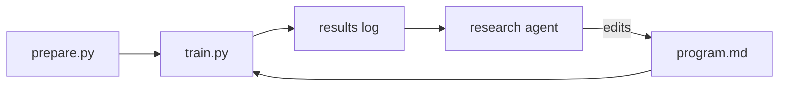

# Structure Guide - Article Shapes and File Layout

This file was rebuilt from scratch against the 50 published posts archived in `reference/substack/*.md` (December 2025 through August 2026). Every rule below is observed in that archive, with the posts that show it named. Where an older version of this guide invented a rule that the archive contradicts, the invented rule is gone. Open this file once a template is chosen; it covers titles and subtitles, the shared anatomy, the four templates, code and image conventions, and the final-draft file layout.

A note on reading the archive files: the scrape preserved markdown headings in most files, but a few artifacts remain. Some headings arrive wrapped in bold markers, some code blocks carry curly quotes, and at least one file (Getting an AI Engineering Job) lost the headings for its first half. If a file reads suspiciously flat, check the live URL in its frontmatter before treating flatness as a style rule.

## What the archive actually contains

The 50 posts fall into recognizable families. Counts are approximate because some posts straddle two shapes.

- Build logs and system stories - the largest group (roughly 20 posts). How I built, fixed, broke, or retired something of my own.
- How-to and method guides - around 6 posts. Numbered steps the reader can copy.
- Analysis and argument essays - around 5 posts. Numbered claims, or findings from scraped data.
- Teardowns of someone else's project - 2 posts (Karpathy's autoresearch, MemPalace).
- Announcements, launches, and course promos - around 8 posts.
- Showcases and digest roundups - 2 posts of student projects.
- Course-module tutorials - the AI Dev Tools Zoomcamp series (4 parts), written as course notes with a series index.

The skill drafts the first four families; they get templates below. The last three are described briefly at the end - if Alexey asks for one, mimic the specific archive post rather than a template.

## Title and subtitle

All guidance here comes from the real title/subtitle pairs in `substack.csv` (39 pairs).

### Title style

Titles run 4 to 16 words, median 9. They are plain and descriptive, usually first person, and they carry a concrete number or named thing when one exists. Colon constructions are rare: 3 of 39 titles use one. Real titles:

- How I Dropped Our Production Database and Now Pay 10% More for AWS
- The System I Built to Ship Code From a Phone
- Six Projects That Didn't Make It
- My PyPI Release Pipeline for Python Libraries
- How to Do Evals in 2026
- What AI Forward-Deployed Engineers Do
- Building and Maintaining a Slack Moderation Bot for an 88k-Member Community
- 5 Useful Utilities I Built with AI Coding Assistants
- Minsearch: The Small Search Library Behind My RAG Workshops and Courses

The recurring patterns: "How I [did specific thing]" (11 of 39 start with How), "My [system/pipeline/experiments]", "The System I Built [for/to] X", a leading count ("5 Useful Utilities...", "50 Theory Interview Questions..."), and the occasional confessional ("How I Dropped Our Production Database..."). Numbers appear in 12 of 39 titles and are always real counts or results, never invented round numbers.

Offer 3-5 title options at kickoff. All of them should fit the norms above; do not pad the list with a clickbait variant, a colon-form variant, or a "tension" variant for coverage - the archive doesn't do those.

### Subtitle style

One plain line, median 12 words, usually no final period, usually a fragment rather than a full sentence. Real title/subtitle pairs:

- How to Do Evals in 2026 - "A tool-agnostic framework for evaluating AI agents"
- Six Projects That Didn't Make It - "But I learned a ton while building them"
- My PyPI Release Pipeline for Python Libraries - "How I release Python packages with agents and without"
- How to Write a Good README - "16 sections your project should have in the README"
- What AI Forward-Deployed Engineers Do - "An Analysis of 113 AI FDE Job Postings"
- Getting an AI Engineering Job - "The 5-step framework that will land you a job"
- 50 Theory Interview Questions for AI Engineer Roles - "Plus downloadable cheatsheets with answers"

Three real moves: a concrete descriptor of what's inside, a numbered promise, or a continuation of the title's own sentence (the Six Projects pair). Offer 3 subtitle options, each a single line in this register. Keep them shorter than you think; the archive's are tight.

## Shared anatomy

The beats below hold across all four templates.

### Opener

One to three short first-person sentences that put a specific situation, project, number, or year in front of the reader before any framing. Real openers:

- "I sometimes run offline workshops. These workshops require participants to have access to cloud resources such as AWS." (AWS access)
- "I published my first Python library in early 2021. Since then, I've released 24 packages on PyPI" (PyPI pipeline)
- "My child has very specific interests and information requests. He asks me to find books on narrow topics like metals or signal sirens" (book generator)
- "People keep asking me how to get started with coding agents. At first, this puzzled me." (coding agent setup)
- "Your README is the first file people read in your project, and sometimes the only one." (README - the reader-directed variant that how-to guides sometimes use)

No abstract framing, no rhetorical-question setup, no "in the age of AI." The concrete case always comes first.

### Roadmap

Almost every post announces its contents within the first 3 to 8 short paragraphs. Two real forms:

- A lead-in plus bulleted list, the dominant form from mid-2026 on: "In this post, I'll share:" followed by 4 to 8 bullets (book generator, minsearch, six projects, ship-from-phone, 11 workshops). The bullets often map one-to-one onto the section headings.
- A single running-text sentence: "In this post, I walk through how the bot is built and how I used AI to diagnose and fix it." (Slack bot); "In this post, I'll share how I let this happen and the steps I've taken to prevent it from happening again." (dropped database).

This block is load-bearing; keep it. Only teardowns and short showcases skip it.

### Headings

Body sections use `##` with short, plain, mostly noun-phrase headings. Real examples: "The workshop problem", "Implementation", "Final Solution", "Incident Timeline", "Curation over Complexity", "Where I use it now". Steps and claims get numbered headings that mirror the roadmap list: "1. Start with an Idea", "Step 1: Choose an Assistant", "1. Business Understanding".

The published posts frequently nest numbered `###` and even `####` sub-steps under a section. Drafts must not: stylint flags any heading deeper than `##`. When a section wants sub-steps, either promote them to numbered `##` headings (as the archive's flatter posts do) or fold them into a numbered list inside the section.

### Paragraphs

One to three sentences is the default, with frequent single-sentence paragraphs used as beats: "The entire production infrastructure had been destroyed." (dropped database); "Done. It was fixed while I was packing and getting ready to leave." (Slack bot). Four-sentence paragraphs appear but are the ceiling, not the norm.

### Lists

Lists are constant and carry real content: requirements, evaluation verdicts, workflow recaps, percentage-annotated findings, checklists. Every list follows a lead-in sentence, usually ending in a colon ("The flow in EC2 looks like this:", "Here are the terms:"). Recaps near the close are often bulleted (deploy article, FAQ system).

### The close

The article proper ends under a plain heading, in three to eight short paragraphs. Real closing headings: "Where I use it now", "What I've Learned", "Lessons Learned", "When Minsearch Is the Right Tool", "Curation over Complexity", "Starting Simple", "What These Tools Have in Common". Data-analysis pieces are the only ones that use a literal "Conclusion" heading (FDE post).

The close restates the arc compactly, extracts the rule ("The rule I took from it: an agent should never have a path to production."), and names what still doesn't work or what stays unresolved (book generator ends on zero copies sold; ChatGPT viewer ends on "polish usability"). Some posts end with a course or subscribe CTA in the last paragraph ("You can use code SUBSTACK to get 20% off. See you there!" - evals post). That is the full repertoire.

### What never gets drafted

No post in the archive signs off with a name. There is no "Sincerely, Alexey" anywhere in the 50 posts; the single personal signoff ("Thanks for being part of the community, Alexey") is Substack's referral-program boilerplate, not article style. What the published posts do carry after the article proper is publish-time apparatus: the "Edited by Valeriia Kuka" credit (31 of 50 posts) and, on regular newsletter issues, the digest sections ("What I've Been Working On Recently", "Tools", "Resources", "Interesting Tools"). None of that is drafted; it gets attached at publish. A draft ends on the closing section or its final CTA sentence, full stop.

## Template 1 - Build Log (default)

Narrating how something of Alexey's own was built, fixed, broken, or figured out. The most common shape; default to it unless the topic clearly fits another template. Archive evidence: the Telegram assistant, SQLiteSearch, the ChatGPT data viewer, the dropped production database, the book generator, ship-from-phone, minsearch, the AWS access system, the FAQ system (both posts), the image-to-podcast pipeline, the Slack bot.

Article-proper length in the archive runs 900 to 2,600 words, typically 1,400 to 1,900.

The beats:

1. Opener - the concrete personal situation, per the shared anatomy.
2. Roadmap - "In this post, I'll share:" plus bullets, or one running sentence.
3. The build, narrated forward - sections walk chronology or system parts. Show the naive first attempt and why it failed before what replaced it ("The first thing I thought about was EC2 instance profiles... But to create instances with the profiles, I'd need to distribute my key to the participants again."). State mistakes in one flat clause and extract a one-line rule ("The rule I took from it: an agent should never have a path to production."). Give claims numbers, dates, prices, and repo links; hedge estimates ("this reduced the time required by roughly a factor of four").
4. Where it stands now - including what still doesn't work. No result ships without its limitation.
5. Close - the reflective section under a plain heading, per the shared anatomy.

Real variants of this shape, all in the archive: the incident postmortem (dropped database - timeline, cause, remediation numbered list, lessons), the retrospective (Six Projects That Didn't Make It - one section per dead project, each mined for a lesson), the tool biography (minsearch - origin, evolution, "When Minsearch Is the Right Tool"), and the multi-project proof of a workflow (the agent-team post - method first, then one numbered section per project it built).

## Template 2 - How-To Guide

A repeatable method or numbered sequence of steps the reader executes. Archive evidence: My PyPI Release Pipeline, How to Set Up Your Coding Agent, How to Write a Good README, Choosing a Portfolio Project, Getting an AI Engineering Job, How to Do Evals in 2026.

Article-proper length runs 1,400 to 2,900 words, typically 2,000 to 2,400 - the longest family.

The beats:

1. Opener - personal credential or plainly stated reader problem ("I published my first Python library in early 2021. Since then, I've released 24 packages on PyPI").
2. Roadmap - the steps stated once, as a lead-in plus list. Getting a Job states it as "The algorithm is straightforward:" plus six numbered items.
3. One `##` per step, number in the heading - "1. Start with an Idea" through "6. Automate Publishing with Skills"; "Step 1: Choose an Assistant" through "Step 6: Use Subagents When Context Gets Too Large". Each section says what to do, why, and shows the real command, prompt, or config, in flowing prose. Weaker alternatives are dismissed inside the step where they belong, not in a separate contrast section.
4. The practical artifact, embedded where it's used - a named tool or skill introduced at the point in the pipeline it applies (the PyPI post's `init-library`, `setup-pypi-ci`, `release` skills), or a liftable checklist near the end (the evals post closes with a 28-line markdown checklist in a fenced block).
5. A short practical wrap before the close - "Other Tips" or "Common mistakes" carrying caveats (coding agent setup, README guide).
6. Close - short, sometimes one paragraph plus a CTA ("The next cohort starts September 21. You can use code SUBSTACK to get 20% off. See you there!").

## Template 3 - Analysis Essay

An essay arguing toward numbered claims, or reporting findings from Alexey's own data. Archive evidence: Benefits of Learning in Public (8 numbered benefits), What AI Forward-Deployed Engineers Do (113 postings analyzed), What 1,000+ Job Descriptions Reveal, How CRISP-DM Still Applies to AI Engineering, What Is an AI Engineer.

Article-proper length runs 850 to 2,400 words; the data teasers sit at the short end.

The beats:

1. Opener - the concrete organizational case or the dataset itself ("Since January 2026 I scrape AI Engineering jobs monthly for AI Engineering Field Guide. So far we have 4,894 descriptions").
2. The list stated once, bare - the claims or dimensions as a plain numbered list before unpacking (Learning in Public states all eight benefits, then "Let's cover each of them in more detail.").
3. One `##` per item, number in the heading - "1. Visibility and Career Opportunities" through "8. Beyond Jobs: Unexpected Opportunities"; "1. Business Understanding" through "6. Deployment". One to three short paragraphs per item. Evidence is a named person, a linked tool, or a stat woven into the paragraph - data pieces annotate bullets with percentages ("Python (82.5%)", "Direct client engagement (90% of postings)").
4. Caveats stated inline where the claim needs them, not saved for the end ("But our data is probably biased because in our scrapes we focus on AI Engineering roles").
5. Close - short and plain. Only the data pieces use a "Conclusion" heading; the personal essays end on a compact forward-looking paragraph. Two of the data posts (1,000+ JDs, CRISP-DM) are written in "we" voice and end with a read-the-full-article CTA; use "we" only when the piece genuinely reports team research.

## Template 4 - Tool Teardown

A read of someone else's project through an engineer's lens. Archive evidence: exactly two posts - Karpathy's Autoresearch Went Viral (about 950 words) and the MemPalace teardown (about 1,700 words). Both are notably shorter than the other shapes; keep teardowns in the 900 to 1,700 word range.

The beats, as the two real posts do them:

1. News-hook opener - what happened, who, when: "Over the last few days, Andrej Karpathy's autoresearch project has been widely shared and discussed." A headline number lands early (MemPalace leads with its 96.6% recall@5 claim).
2. A one-sentence statement of the work behind the piece, in place of a roadmap: "I looked through the repository and decided to write a short note explaining what the project actually does and why it is attracting so much interest." Neither teardown has a bulleted roadmap.
3. Mechanism sections - plain `##` headings naming what each part is, specific to the tool: "Core Idea", "Repository Structure", "Optimization Process", "How Room Detection Works", "Ingestion Pipeline". Walk the 3 to 6 mechanisms this tool actually has; concrete numbers throughout (chunk sizes, token budgets, module counts, license).
4. Others' usage where it exists - the autoresearch post has an "Others Experimenting with the Pattern" section citing real follow-on projects, woven in as evidence rather than a reception roundup.
5. A verdict close under a heading like the real ones - "Why People Find It Interesting" / "What Makes This Interesting" - saying plainly what is solid, what is clever, and what it means ("There's nothing magical here - it's solid engineering with a few clever ideas"). The autoresearch post adds a "Project Idea" section riffing on what the reader could build with the pattern; that move is optional but real.

Neither teardown carries newsletter apparatus, a comparison table, or a standalone recommendations checklist. Do not add them.

### The component diagram requirement

When the piece breaks down someone else's codebase or architecture, the draft must include a real component diagram, authored as a Mermaid diagram in a ```mermaid fence: a flowchart or graph showing the actual major components and how they connect. A vague `[IMAGE: ...]` placeholder standing in for the architecture is not acceptable in this template - a "read the code" piece with no code-level visual undercuts its own claim to have read the code.

The published posts back this up: technical pieces routinely carry inline architecture and pipeline diagrams (the evals post's gold-standard-to-judge pipeline diagram, the deployment post's FastAPI-plus-Vite architecture diagram, the FAQ system's seventeen captioned diagrams), and Alexey authors his article diagrams in Mermaid via his own merm tool ("now I use it to generate diagrams, including the ones in this article" - Six Projects That Didn't Make It). A Mermaid fence in the draft is the source form of exactly what publishes as a rendered image.

Keep the diagram high level: the major components and their relationships, in the tool's own vocabulary, not implementation minutiae. Introduce it with a sentence like any other block. A shape to aim for:



Screenshots of someone else's UI or README can supplement the diagram; they don't replace it.

## Other archive shapes, not templated

These exist in the archive but are not what the skill normally drafts. If asked for one, open the named post and mimic it directly.

- Announcements and course promos (Last Call for AI Engineering Buildcamp, the Buildcamp rename, the AI Shipping Labs launch, 11 Workshops): CTA-driven, list-heavy, often ending on a join/register button rather than a reflective close.
- Showcases (5 ideas for AI agents, 9 Real-Life AI Projects): one numbered `##` or `###` per project, two to four short paragraphs each, builder credited and linked.
- Course-module tutorials (the AI Dev Tools Zoomcamp series): a series index up top, a "We will:" bulleted roadmap, many short fenced prompt blocks, a "Next in the series" close, no digest apparatus.

## Code snippets

Code is rarer than you'd guess. Most build logs have zero fenced blocks; screenshots and inline backticked commands do the work (the Telegram assistant, Slack bot, dropped database, and agent-team posts have none). How-to guides carry 1 to 8 short blocks; only the course-module tutorials go above ten, and most of those blocks are prompts to agents, not code.

When a draft does need a block:

- Keep it 1 to 20 lines, showing the essential piece, not a codebase.
- Introduce every block with a sentence, and never place two blocks adjacent - the archive always has prose between.
- Tag the language: `bash` for commands the reader runs, `text` for output, prompts, file trees, and env examples, `python` (or the real language) for code. The archive scrapes are untagged, but that is a scraping artifact; stylint requires tags in drafts.

A shape that recurs in the archive is the introduced one-liner:

```bash
uv add minsearch
```

preceded by a sentence like "now people can install it with `uv` or `pip`:" and followed by what happens next. Prompts given to agents go in `text` blocks introduced the same way ("Ask the coding agent:").

## Images and diagrams

The published posts are image-heavy (screenshots, diagrams, phone photos), but drafts don't embed real images. Architecture and pipeline diagrams are the exception: author those directly in the draft as ```mermaid fences (see the teardown template's diagram requirement - the same applies whenever a build log or how-to hinges on an architecture the reader must see). For screenshots and photos, leave a clearly marked placeholder where the visual belongs, with a plain caption naming what's shown:

```text
[IMAGE: Diagram of the credential flow - Codespace, Lambda, STS, sandbox account]
Caption: The Lambda assumes the role and returns temporary credentials in the format the SDK expects.
```

List all placeholders again in the meta file so nothing is lost at publish time.

## Final draft file layout

A finished draft is two files in `articles/claw-drafts/`, so the linted file contains nothing but publish-ready article prose.

### The article file: {slug}.md

YAML frontmatter with the working title and chosen subtitle, then the article exactly as it should publish: opener through closing section, ending on the close's last sentence or CTA. No signoff, no editor credit, no digest sections, no platform notes, no horizontal rules. This file is the stylint target and should pass the full check; structurally it should be indistinguishable from an archive post minus the publish-time apparatus.

```markdown
---
title: "{Working title}"
subtitle: "{Chosen subtitle}"
---

{Opener through close, publish-ready}
```

### The meta file: {slug}-meta.md

Everything the publish step needs that is not article prose. This file is internal publishing notes, not user-facing prose - never run stylint on it; when linting the directory, pass `--exclude '*-meta.md'`.

```markdown
# {Working title} - publishing notes

## Platform deltas

Substack (Alexey On Data, aishippingblog.com):
- Subtitle: {chosen subtitle}
- Paywall: place the break after {section}, if paywalled
- Publish-time apparatus added on Substack, not in the draft:
  editor credit, digest sections if it's a regular issue

Medium:
- Topic tags: {5 tags}
- Member-only: yes/no
- End CTA: {the Medium-specific closing line}

## SEO keywords

8-12 phrases mixing head terms and long-tail phrases for this topic.

## Title and subtitle shortlist

Titles:
1. ...
2. ...
3. ...

Subtitles:
1. ...
2. ...
3. ...

## Image placeholders

1. {placeholder + caption, copied from the draft}
```

Keep both files' slugs identical so they sort together, and update `claw-drafts/_index.md` and `articles/_index.md` per SKILL.md when saving.
