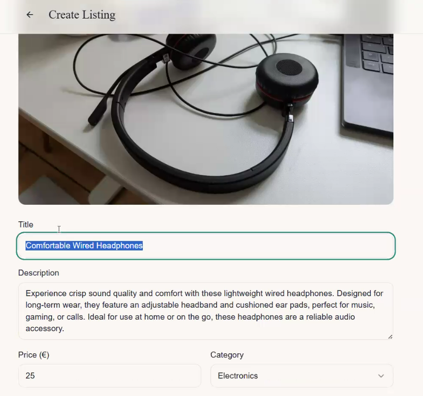
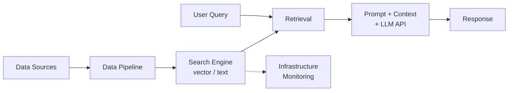
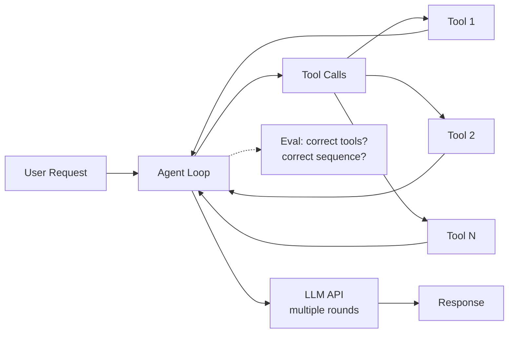
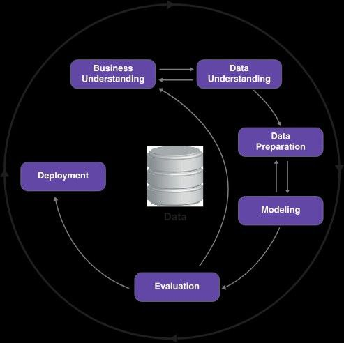

# Day of AI Engineer

This article describes my personal vision of the AI engineer role, compares it with traditional data team roles, and shows how the CRISP-DM methodology applies to AI projects.

This is based on the text planned for the "Day of AI Engineer" webinar. Not everything was covered during the live session, so this includes the full planned content along with insights from the actual webinar and Q&A.

## Context

I'm preparing for a "Day of AI Engineer" event and want to share how I see this role. The high interest in previous posts about webinars confirmed there's appetite for this content. Rather than relying on others' data or surveys, I want to describe the role from my direct experience.

As someone teaching AI engineering courses and working with ML and AI for years, I have a clear vision of what the AI Engineer role should be. I'm collecting data to compare my vision with industry reality.

I also have a reference article about data team roles at DataTalks.Club. It is about 5-6 years old now, but it describes the roles in a data team: Product Managers, Data Analysts, Data Scientists, Data Engineers, ML Engineers, and MLOps Engineers. Things have changed since then, and this event is a good opportunity to revisit these roles in the context of AI engineering.

## Core Responsibility: AI Integration

The main responsibility of the AI Engineer is integrating AI into the product, whatever that means. In practice, integrating AI into a product typically means interacting with an LLM provider like OpenAI, Anthropic, or others through their API. You know how to call this API, it returns something, and then you integrate these results into whatever product you are working on.

AI engineers communicate with product managers. Product managers interact with users and know what user problems are. Together, the product manager and AI engineer identify whether AI could be the solution. It's not like we heard AI is cool and decided to integrate it. There is some problem that users have, and we realize we can help solve it with AI.

Having OpenAI simplifies things compared to traditional ML engineering. ML engineers don't have the luxury of a provider with an existing platform. For AI engineers, 85-90% of the work is sending requests to OpenAI, Anthropic, or some other LLM provider, and then coming up with the right prompt.

## The Role is Similar to ML Engineering

It is very similar to data science. If you think about data science - what data scientists need to do, what ML engineers need to do - they need to integrate machine learning into the product. Here everything is similar. The roles of ML engineer and AI engineer are very similar.

Data scientists focus on creating the model: translating business requirements to ML, designing evaluation datasets, designing training sets, training the model, testing and loading it. ML engineers focus on bringing models into production. AI engineers need to do both, but there is no real modeling since the model already exists. Most of the effort goes to prompt tuning. So AI teams don't necessarily need a separate data scientist role - the AI engineer can handle both parts and focus on everything around it.

For ML engineers, the transition is easy: you just replace a call to a locally hosted model with a call to OpenAI. The rest is the same. ML engineers would need to work a bit on the evaluation side. Data scientists would need to work on the engineering side. For ML engineers, it's probably the easiest transition.

## Simple Example: Online Classifieds with AI Pre-filling

GitHub: https://github.com/alexeygrigorev/simple-sell/

To illustrate what AI engineers do, consider this example. We have a web interface for an online classifieds website where you can upload anything. Based on what you upload, it classifies the type, extracts the details, and fills everything automatically.

I created this website with Lovable. The prompt was: create an online classifieds platform where people can create and see things to buy and sell. It will be very simplistic - a list page with products, a create page where we create a listing (title, description, categories, and a place to upload a single image). Plus there's a contact button that currently doesn't do anything. The listings come from API (mock it for now) and when we save the event, it also saves into the API. We also pre-fill the details with AI. The posting flow: first they ask the image, you upload, and then you see the form with all pre-filled information from the image. All the API interactions are in a single file.

<figure>
  
  <figcaption>Prep: creating the example marketplace with Lovable in one prompt</figcaption>
  <!-- My preparation for the webinar - building the demo project with Lovable -->
</figure>

With a second prompt, I asked Lovable to rename the website and switch to EUR pricing.

<figure>
  
  <figcaption>Prep: second prompt renamed to "Trova" and switched currency to euros</figcaption>
  <!-- My preparation for the webinar - adjusting the demo project -->
</figure>

Then I exported this from Lovable and added backend support with Claude Code.

<figure>
  
  <figcaption>Prep: using Claude Code to add a FastAPI backend to the example project</figcaption>
  <!-- My preparation for the webinar - adding backend with Claude Code -->
</figure>

I asked Claude Code to create a simple FastAPI backend that takes care of listings and pre-filling with AI. It should return the content, and there would be two endpoints: one for adding a listing and another for pre-filling it with AI.

### What the AI engineer does with this example

<figure>
  
  <figcaption>AI pre-filling the listing form after uploading a photo of headphones</figcaption>
  <!-- Demonstrates the core AI engineer task: upload image, get structured data back from the LLM, auto-fill the form -->
</figure>

The prototype: I uploaded a picture of headphones. The LLM returned "Comfortable wired headphones - experience crisp sound quality and comfort." This sounds like a marketing person wrote it. For an online classifieds platform, the description should be more like "comfortable headphones, I didn't wear them for long, just get them right now." As AI engineers, we can go back to the prompt, edit and modify it to get the right tone.

The simple implementation is literally 56 lines of code ([ai.py](https://github.com/alexeygrigorev/simple-sell/blob/main/backend/app/services/ai.py)):

```python
class AIAnalysisResult(BaseModel):
    title: str
    description: str
    category: str
    price: float

SYSTEM_PROMPT = f"""
You are an assistant that analyzes images of items for
a marketplace listing.

Given an image, suggest:
- A concise, appealing title
- A detailed description (2-3 sentences)
- A category from this list: {", ".join(CATEGORIES)}
- A fair price in euros
""".strip()

async def analyze_image_with_ai(image_bytes: bytes) -> AIAnalysisResult:
    client = AsyncOpenAI()
    b64 = base64.b64encode(image_bytes).decode("utf-8")
    messages = [
        {"role": "system", "content": SYSTEM_PROMPT},
        {"role": "user", "content": [
            {"type": "input_image",
             "image_url": f"data:image/jpeg;base64,{b64}",
             "detail": "low"},
            {"type": "input_text",
             "text": "Analyze this item for a marketplace listing."},
        ]},
    ]
    response = await client.responses.parse(
        model="gpt-4o-mini",
        input=messages,
        text_format=AIAnalysisResult,
    )
    return response.output_parsed
```

You may think: all they need to do is send a request to OpenAI and call it a day?

But not quite. Here is everything that needs to happen:

1. The prompt - how good is this prompt? We need to test it. We need to make sure that the agent is actually doing what we want. We create a test where we send an image and verify the output ([test_ai.py](https://github.com/alexeygrigorev/simple-sell/blob/main/backend/tests/test_ai.py)).

2. Evaluation dataset - we can have a few tests, but we can also have an evaluation set where we have a bunch of images. We run this extraction process and verify that every time we run with the current prompt, we get what we want. This becomes our evaluation dataset. Tests must always pass. The evaluation dataset gives us a metric of how good our model is doing. Sometimes the model describes something incorrectly - it is not the end of the world. Sometimes it is really important. We define all that.

3. Iterating on the prompt - we change something in the prompt, we run the evaluation set, we see that the model is not degrading. It is very important to have all these things.

4. Rolling out to users - if everything works, we can roll it out. But how? We need to make sure there are no regressions so user experience stays good. We split this to do an A/B test - roll out to a small portion of people first.

5. Production monitoring - we observe that there are no errors. It is very important to have proper production monitoring. In how many cases does our endpoint not return anything? It breaks. We need a dashboard for that.

6. Collecting logs and inspecting results - we also need to know in how many cases this does not work. We need to be able to inspect the results, inspect the input, inspect the output, and see if things are misaligned.

7. Human annotators - we can add humans here, human annotators that regularly sample data from this monitoring system and verify things work. When humans evaluate and we roll it out to some users, they can see some problematic cases. We can actually add these to our evaluation set.

8. Model updates - we deploy the system, everything works, we rolled out to all users, we have monitoring, we have evaluation set, we have testing. Then OpenAI releases a new model. We need to update to the new model. We run it on the evaluation set and we see that things don't work so well as before. But because we have evaluations, we can actually determine this.

9. Prompt versioning - when we iterate on the prompt, we need version control for prompts. How do we control the version of the prompt? We need a proper experimentation system in place. Could be MLflow, could be just keeping things in Git, but it is something important. When we evaluate something, we need to know what we changed. Did we change the prompt? Maybe if we are working on an agent, we changed some tools, maybe we changed the model. We need to know what exactly we changed. We need to properly set the experiment - this is the change and this is the result.

10. Feedback from users - we also need to collect feedback. Feedback could be explicit - if we add a thumbs up or thumbs down button and the user clicks on that, that is explicit feedback. But also implicit - maybe the user corrects the output. We need to think about all these things.

Even for this simplest example, there are so many things that need to happen. It is not enough to just define a Pydantic class, send it to OpenAI, and call it a day. There is a lot of things that need to happen to properly integrate this into the product.

We did not even talk about UI changes. There also need to be UI changes. Typically front-end engineers do this, but in some cases, if you work at a startup, AI engineers might also do that. With AI assistance like Claude Code, it doesn't really matter if your TypeScript knowledge is not the best. AI engineers or any engineer can make these changes, they can integrate this into the product. But typically in bigger companies, it would be a front-end engineer.

<figure>
  
  <figcaption>Prep: Claude Code building out the example project - backend, API, AI service, tests</figcaption>
  <!-- My preparation for the webinar - Claude Code task list showing the demo project build progress -->
</figure>

In this example, we have tests ([test_listings.py](https://github.com/alexeygrigorev/simple-sell/blob/main/backend/tests/test_listings.py), [test_ai.py](https://github.com/alexeygrigorev/simple-sell/blob/main/backend/tests/test_ai.py)), we have CI/CD ([test-backend.yml](https://github.com/alexeygrigorev/simple-sell/blob/main/.github/workflows/test-backend.yml)), you can see everything that is implemented.

### Also CI/CD

When we talk about testing and deployment, CI/CD is important. When we run tests, we want to be able to run these tests on push to Git. When we deploy, we want to be able to deploy to a staging environment. When our tests on the staging environment pass, we want to roll out to production. Setting this up, of course, the AI engineer would not be doing this alone. Typically there could be some platform engineers that help. But if it is a startup, knowing how to do these things will certainly help.

## Complex Scenarios: RAG and Agents

That was just a very simple thing. But imagine we go from this simple thing to RAG. We make our process more complex. Now we have a search engine that we need to use, something like Elasticsearch. We need to ingest the data. We need to know how to build data pipelines, and how to build data pipelines reliably, because the data is coming from somewhere. We need to put it into our search engine. This could be a vector search engine or a text search engine. We need to be able to do that. Sometimes, oftentimes, we need to be able to provision the infrastructure for that.

Simple case - just call the LLM API:


With RAG, things get maybe 5 times more difficult. Now we need a search engine, data pipelines, infrastructure:



We also need to handle reliability: what if the database goes down? What if it's slow? We need to think about all of these scenarios.

With agents, complexity grows to maybe 10 times the simple case. Multiple tool calls, multiple LLM rounds, evaluation of tool correctness:



We need to make sure agents can use tools reliably. We need to write tests for tools and for agent behavior. We need to update our evaluation framework and criteria - in this scenario, these tools must be used, things like that. The evaluation dataset becomes more difficult because we need to verify the correct tool is called for each scenario and that tool combinations work correctly.

In the simple case, it is already a lot of work. All these things are solved by AI engineers.

## AI Engineers vs ML Engineers

The task of an ML engineer is to integrate machine learning into the product. The task of AI engineers is to integrate AI into the product. What is the difference?

Typically, if we talk about LLM providers, the difference is that you already have an LLM, you just call the web service, versus actually having the weights and owning the model. In some cases, yes, we have open source LLMs. There are cases where you need to serve the LLM yourself. Then this becomes your responsibility as AI engineer too. In traditional ML, it is always the responsibility of the ML engineer to actually serve the model.

### LLM Serving

There are many tools for serving LLMs, like vLLM, but the tools are secondary - just knowing that you need to do this matters. LLMs require special hardware. You also need to know how to provision infrastructure for this hardware. Typically this is also on the AI engineer. For an ML engineer, it could be similar - if you need to serve a neural network model, the difference is that LLMs require a lot more power, bigger GPUs. This is the main difference with ML engineers.

## AI Engineers vs Data Scientists

Data scientists focus on training models, experimenting with models, conducting experiments, translating requirements from product to machine learning terms. They work on creating data and so on.

When it comes to AI (using LLMs), the model is already there. People from OpenAI trained the model, so they went through the process. We don't need this. In cases when we do something simple, when we don't need to fine-tune, when we don't need to do anything else - we don't really need data scientists. It depends on the size of the organization, but if we talk about a small AI team, we don't really need data scientists here.

## Bigger Organizations: Traditional ML + AI

In bigger organizations where we have also classical machine learning, the setup is: data scientists work on a model, on translating requirements into machine learning terms, and ML engineers work together with data scientists to productionize it. The engineer focuses more on serving the model, CI/CD, tests, best engineering practices, infrastructure. Data scientists focus more on modeling, testing, experimenting.

Now let's say there is already a team that has been doing machine learning for quite some time, but now they have an AI use case. In this setup, both data scientists and ML engineers would work on it. Data scientists would focus more on interacting with the model, understanding how to call it, how to tune the prompt, how to set up the validation framework - how to make sure that the model, the agent is behaving the way it should behave. The ML engineer would focus more on the engineering aspects. This would be the setup in teams where there is not necessarily an AI engineer yet. They would split the responsibilities of AI engineer into both roles. And frankly, if we talk about a bigger project, bigger company, they will both have so much work.

The company might decide to hire an AI engineer who will work together with data scientists on these things. But the data scientists will also have responsibilities of taking care of traditional machine learning, maybe some legacy systems, but also some systems that they need now - because LLM is not the answer to all the questions. AI now is very good at solving a subset of some problems, but there are so many problems that don't need LLMs. We still need data scientists, we still need machine learning engineers. They still need to work on what they have been working on. But some problems are of course simpler now - NLP is simpler, many things are simpler now with LLMs.

## Teams Without Dedicated AI Engineers

Many companies don't have dedicated AI engineer roles. Instead, existing team members take on AI responsibilities. Data scientists focus on designing experiments and evaluation. ML engineers focus more on monitoring and deployment.

The job titles may be old, but the tasks are new. Instead of training models from scratch, they use OpenAI or similar APIs. Everything else remains the same.

In teams where we don't have AI engineers, the responsibilities would be split between data scientists and ML engineers.

## What AI Engineers Don't Focus On

Unlike traditional ML engineers, AI engineers typically don't:
- Create models from scratch
- Build custom model architectures
- Focus heavily on feature engineering in the traditional ML sense

Sometimes using the API is too complicated and you might need to replace it with a traditional ML model. But ML knowledge is not necessarily something AI engineers automatically should know. Being a "full-stack role" doesn't mean automatically knowing ML.

Instead, AI engineers focus on:
- Engineering best practices for AI systems
- Effective prompt design and versioning
- Integration of AI capabilities into products

## CRISP-DM for AI

CRISP-DM (Cross-Industry Standard Process for Data Mining) is a methodology from 1996 that organized how data mining and ML teams work. What's remarkable is that this framework, originally designed for data mining, remains highly relevant for AI projects today.

All the processes that data teams have used since the 1990s remain applicable to AI projects. The steps we take in AI projects map directly to the CRISP-DM framework.

I wrote about CRISP-DM in my book, and the concepts described there apply equally to modern AI engineering.

<figure>
  
  <figcaption>The CRISP-DM cycle: six phases that form an iterative process for data-driven projects</figcaption>
</figure>

### Running Example: Online Classifieds with AI

To illustrate how CRISP-DM applies to AI, we use the same example as before: an online classifieds platform. In machine learning, we would have a classification problem. In the AI case, we upload an image and from this image we want to reliably extract the information we need.

### Business Understanding

We don't just solve problems for the sake of solving problems. Not "hey, we have AI, how about we use it" and then start thinking of different use cases. No - it should come from a real user problem. Maybe we already know about this problem. We already tried to solve it differently, but now we think we want to try to solve it with AI.

We need to have this business understanding. What is the problem? Why do we want to do this? Not just because we want a cool new feature, but because there is a real problem that users have with our product that we will solve. This is usual work that product managers do, user experience researchers do. There should be a real problem or a hypothesis that this problem exists and we want to verify this hypothesis.

We need to understand: how many people does this affect? At this point, we think more about the problem, not the solution. How can we measure it? What could be the metric for solving this problem?

For the classifieds example: users complain that it takes so much time to fill the form. There is some existing user research that confirms this. Otherwise we need to conduct this research to find out this is actually a problem worth solving. Maybe users don't really complain about this. If we solve a problem that doesn't exist, nobody will care and we waste money and time.

Then our goal becomes clear. Right now it takes five minutes to fill the form, and we think we can reduce this time to one minute. We can also have secondary metrics - like users who started filling the form and didn't finish because it was too complex. Right now that is 15%, but we want to drop it to 5%. The important part is we need to have this research, we need to understand there is a problem, and we need to understand this is a way to solve it.

For integrating AI into products, this is very important. We don't want to spend time on solving a problem that doesn't exist.

The AI engineer's role here is to work with product managers to understand: do we actually need AI here, or is there something simpler we can do? Previously for machine learning, building a model was more expensive and took more time. Sometimes you could solve the problem by using rules. In case of AI, testing a hypothesis is cheaper in terms of time, but we still need to understand if it is worth solving with AI or if we can use something else.

### Data Understanding

At this point, we want to understand if there is data we can rely on to build our model. In case of machine learning, we need to determine if we have training data. In case of AI, we need to understand what data we have available.

We need to send something to AI. Do we have everything we need for that? We want to understand how difficult it would be to integrate what we need. In our example, when we send data to AI, we need to make sure the front end can send all the data we need. That is one thing.

But let's say we are talking about integrating AI into something else - it could be something not user-facing, running on the backend. You can use AI to optimize some processes. There it is very important that you have some data for AI to act on, because it needs to get in some data.

In our case, the input will be a picture. Of course, in our case it is easy - we already have the picture.

For RAG cases, we also need to think about data understanding and data preparation. Do we have all the data we need? Do we have the integrations we need? Some services are not easy to integrate to or access. This is something we also need to keep in mind.

### Data Preparation

In case of machine learning, we just need to fetch the data from different sources. We need to prepare it in the right format. For this particular case, it is less important. But if we want to use AI for recommendations or search or things like that, of course we need to have data available.

In some cases, where we want to integrate into products like search and recommendation, we need to be able to access this data.

We are talking about data preparation steps. We need to prepare data in such a way that we can put this into the model. In our case, it is an image, it is text. This is fairly simple. We just fetch whatever image was sent to us from the front end. We send it to OpenAI, we process, we get data, and we send it back. There is not much data pre-processing.

For agents that need to access things, we need to think about whether we have all the data we need and whether we have the integrations we need. Some services are not easy to integrate to or access.

### Modeling

There is not much of a traditional modeling step, but I would change it a little.

In case of ML, here we do the actual training. We train the actual model. We also evaluate the model - cross validation, all sorts of things. In the AI case: we have the prompt, we have our output class (the Pydantic model), we have input. Then we set up the validation framework, we set up the tests for our AI system.

We need to collect evaluation data, we need to evaluate our model. This is a process very similar to what we would do with machine learning, except we don't train the model. We have other criteria, other things we are optimizing. The important thing is that we have a metric - not necessarily a business metric, but more like a technical metric for how many images we are able to extract correctly. Then we change our prompt, we tune our prompt, we do other things.

Important thing in CRISP-DM: the evaluation we do with cross-validation and metrics like accuracy is not the "evaluation" step in CRISP-DM. That belongs to the modeling step.

### Evaluation

At the evaluation step, we actually see how it affects the product and how it affects the users. We take what we developed and we roll it out to users. We run some sort of A/B tests.

We remember at the business understanding step we defined the metric. Here we see if this metric is good. We also collect feedback from people - this implicit feedback. We see how often people change the output, how good it is. But the important thing is if users were able to do this faster than before.

Here we can introduce extra metrics to measure the performance of our model, but the main metric was defined in business understanding. Here we can see if this is good or not.

CRISP-DM is a fairly old model. Before, evaluation and deployment were kind of separate, but now they are almost the same. You deploy to a part of users and then if everything works, you say okay, it is good. We can roll this to everyone.

If during the evaluation we see something is off, we either refine our business understanding, or we can say: with what we have right now, it doesn't seem valuable to continue with this project, so we are parking it for now. This could be an outcome too - saying that we cannot achieve what we wanted. And this is an outcome too. Between the initial idea and this outcome, ideally you want to spend as little time as possible.

This would be the first iteration, but on the second iteration, you would spend more time. The goal is to iterate. This process is very iterative - you iterate as many times as possible.

### Deployment

Deployment remains similar: putting the system into production. The entire process is iterative - we cycle through these steps until performance is satisfactory.

### Who is Involved at Each Step

The roles involved at each CRISP-DM step:

- Business understanding - product managers, AI engineers. AI engineers help PMs understand if it is something AI can solve
- Data understanding - data analysts, product managers, AI engineers, backend engineers. Together with analysts, AI engineers try to understand the data. Could involve people from other teams if you need data from there
- Data preparation - data engineers and AI engineers. If you don't have a data engineer in the team, AI engineer will need to do this
- Modeling - strictly AI engineers
- Evaluation - AI engineers, analysts, product managers. Analysts help set up the A/B test. PMs need to be involved to double-check that we track the right metrics. We need to set up the experiment properly
- Deployment - AI engineers, platform engineers

AI engineers are involved in pretty much every step.

### The Iterative Nature

CRISP-DM emphasizes that projects are iterative. We never truly "finish" - we iterate until we achieve satisfactory results, then continue improving. This iterative approach is essential for AI projects where:
- User behavior may be unpredictable
- Prompts need refinement
- Evaluation metrics may need adjustment

This is a valid framework for AI projects. You don't necessarily have to follow each step, but it gives a good mental model to understand how you can approach not only machine learning projects, but also AI projects.

### Historical Context

The fact that a framework from 1996 remains relevant tells us something important: while the tools change (from training models to API calls), the fundamental process of building data-driven products remains constant.

The processes data scientists have always used - evaluation, versioning, experimentation - are exactly what AI engineers need today. This is why data scientists often make excellent AI engineers with some additional coding practice.

## Q&A

After the webinar, there were many questions that I didn't have time to answer live. The webinar went really well with a lot of engagement. I promised everyone I would answer these questions, so here they are.

### Questions Answered Live During the Webinar

These questions were answered during the live webinar session.

### Data Engineer to AI Engineer Transition

Question: How can a data engineer transition to become an AI engineer?

For data engineers, it's primarily an engineering role, not a research or science role. Most "AI" work is just tweaking prompts and other engineering tasks. Data engineers already know tests, CI/CD, monitoring. The flavor might differ - data monitoring vs AI monitoring - but the tools are very similar. Data engineers already know how to collect logs.

The specific skills to learn: how to interact with LLM providers, how to tune prompts, how to evaluate models. Since data engineers already have the engineering background, it's way easier. After 3-4 months of learning AI-specific testing and evaluation, a data engineer should be ready to transition.

For RAG specifically, you need a search engine, which needs data, which needs an ingestion pipeline. This is what data engineers have been doing their entire career. As a data engineer, you can already join an AI team by contributing to data pipelines and gradually shift to more AI-related work.

How relevant is data engineering in the AI era? Super relevant. Without data engineering, nothing will work. We still need data going into our search engines. There are so many things relevant for AI.

### Interview Preparation Focus

Question: How to narrow down what to focus on when preparing for interviews in terms of topics?

The most important parts to focus on:
1. Learn how to interact with LLM APIs
2. Understand how to create agents - LLMs with tools. Tools are everything, all the actions that LLMs can do
3. Know about RAG - it's the foundation for many, many AI applications
4. Testing - how to test your agents, how to make sure they behave the way you want
5. Monitoring - AI-specific monitoring aspects
6. Evaluation - this is the most important part

I cover all of this in [my course](https://maven.com/alexey-grigorev/from-rag-to-agents). This covers the most important 20% that accounts for 80% of the work.

For projects: pick a specific domain, like e-commerce or online classifieds. Go to their website, see what problems they solve, think about how to solve them, and create a small project showing you can do it. Do this multiple times, then go to interviews and talk about these projects.

You can already figure out what to focus on from job descriptions alone. A more detailed data-driven answer will come at the next webinar with job description analysis and interview examples.

### AI Automation Specialists vs AI Engineers

Question: Why do people who are AI automation specialists call themselves AI engineers? What is the difference?

This might refer to QA engineers who automate testing, or people using tools like N8N or Zapier with LLMs. I wouldn't necessarily call them AI engineers in the terms I described today.

Since the role is new and there is no strict definition, anyone can call themselves AI engineers and be partially correct. What I presented is my personal view, and these people who are AI automation specialists might disagree.

But are they engineers? In my opinion, not really. If they do just clicking, there is no engineering rigor, no best engineering practices, no tests - without that, I wouldn't call myself an engineer. But it's just me. Maybe the title sounds cooler. AI automation with tools like N8N is still pretty cool though.

### Good Backgrounds for AI Engineers

Question: What do you see as past experiences of active and impactful AI engineers - previous jobs as software engineers, data scientists, ML engineers?

Data scientists and ML engineers are excellent future AI engineers. I worked as a data scientist and spent a lot of time evaluating and deploying models. When I deploy models, most of the things I talked about in the presentation also apply to ML engineers. You just replace a call to OpenAI with a call to a locally hosted model, and the rest is the same.

Data scientists are less focused on engineering - they would need to work on the engineering side. ML engineers are more focused on engineering but would need to work on the evaluation side. For ML engineers, it's probably the easiest transition.

For any engineer: you know engineering best practices, you know testing. Software engineers are the best target audience for my course because you already know how to program, write tests, and many other things. It's way easier to start with an engineering background and add AI on top of that, rather than start with a research background and add engineering on top.

Even though my title was data scientist, I called myself an engineer all the time because my focus was always on deploying models, on MLOps. You need to be a builder - know how to build things reliably. Generalists make good AI engineers. If you know how to do many things, not necessarily at an expert level, but a bit of everything, you'll be a good AI engineer.

### Is Traditional NLP Legacy Tech?

Question: Is traditional NLP/ML engineering now effectively legacy tech?

Probably yes. gpt-4o-mini is insanely cheap. In my course, I use gpt-4o-mini and I haven't managed to spend a dollar yet. For structured text processing, it's nearly free. The effort calculation is obvious: how much effort do you need for traditional NLP models versus just sending your stuff to gpt-4o-mini?

There are probably still some cases where traditional NLP makes sense. Simple cases like a spellchecker. Or in search, when you have a typo, you still want to retrieve results, and you don't want to add extra latency - search needs to be very fast. But in general, the answer is clear.

### Future of Engineering Roles as AI Gets Smarter

Question: What do you think about the future of software engineering, data science, and even AI engineering roles as AI is getting smarter each day?

I saw a post on Twitter today. Somebody asked: why does Anthropic have so many open software engineering positions if Claude is good at everything? The creator of Claude Code answered that somebody still needs to check the output, interact with it, give proper instructions, and check the results.

Just today, I was working with Claude Code. I asked it to fix a bug. It fixed it, then I said run tests. Two tests were broken. It said "this is a pre-existing thing, not my fault, I don't want to deal with this." I said "but it is, because this is directly related to what we just changed." It apologized and said "yes, you're right." Then it proceeds to fix the test by completely deleting the old test and creating a new one. I asked "wait, why did you delete this test?" It came up with some excuse. I said "this new test is good, but add the old test back and make sure it passes." It reluctantly did it.

They are sometimes sneaky and lazy. This was Opus 4.6 - the best coding model we have. It tried to cover up that it didn't want to fix my test. It's like a very enthusiastic intern - they can work really well, but sometimes they're sloppy and we need to look after them.

I don't think engineering is in danger. We still need to watch after AI, we still need to enforce best engineering practices. Without that, AI will create something that doesn't work and is dangerous. So basically, engineers are safe.

With data science, maybe not so sure. For simple things, GenAI kind of replaces a data scientist to some extent. Data scientists who don't really do engineering - if they get laid off, it's not so easy for them to find a job.

### Questions Answered After the Webinar

These questions were submitted via Slido and answered offline after the webinar.

### AI Architect vs AI Hobbyist

Question: What specific technical evidence or "proof of work" makes a candidate stand out as a legitimate Architect rather than just an AI hobbyist?

First, these terms are not very concrete. What is an architect? I don't know. What is an AI hobbyist? I also don't know. Is an AI hobbyist someone who learned to run N8N, or something more?

For example, I can do something in a notebook and run it, and it already solves some problems. I see nothing wrong with that - it's actually great. Many things I personally do with AI are these small mini-projects that do something. For instance, I run Claude Code and it automates something for me, saving a lot of time. It's personally super useful. Can you call me an AI hobbyist? Maybe.

I won't speak about architects specifically, so let me answer about AI engineers instead. How do you tell an AI hobbyist from an AI engineer? I already talked about this during the presentation when we discussed NIT and other things.

The difference between an engineer (any engineer) and a non-engineer: engineers know and follow best engineering practices. Tests are familiar to them, they know how to do them. All the best practices around tests, data-driven decisions - they have all of that. Monitoring is a must. They know how to collect feedback.

For a non-engineer or hobbyist - when I do something for myself, it's not a product. I don't have a good test suite, I don't have good monitoring. And that's fine. For my personal use I don't need it. I can just run it, see if it solves the problem, great. If not, I adjust it for myself. I don't need to write some big comprehensive solution. But if I worked at a company integrating an AI product, that's when you need all of it. That's the difference between an AI engineer and an AI hobbyist.

As for architects - that's a vague concept. Architects deal with things like caching, building flows from components. This architecture is not drastically different whether you're building ML systems, AI systems, or regular software engineering systems. If you take a traditional software architect who knows a bit about ML and AI, they're essentially a ready-made AI architect. I haven't personally met such people, but I can roughly understand what this is - someone who comes to a client, designs how the system should look, and someone else implements it. Or in a company, they have a very high-level overview of everything happening.

### AI Engineer Job Uniformity and Top Skills

Question: How uniform/similar are AI Engineer job posting descriptions and requirements? What would be the top 3 must-have skills common across all these postings?

I will answer this at the next webinar, which will be about the definition of the job. I looked at a lot of positions and extracted this data-driven from the freshest positions available. I'll add a screenshot with useful information. But we'll discuss all of this at the next webinar. I'll do the main part of the presentation that I planned, but I'll spend most of the time answering your questions.

### Advice for New Graduates

Question: What should a recent or new grad focus on in order to break into this role?

Projects. You need to do as many projects as possible. I've talked many times about how to choose projects - I should probably record a separate article about this, that's a good idea. Do projects in the areas of AI that interest you, and based on that, go to interviews.

Also important: networking, knowing people who are hiring, attending meetups - all of this helps. But the main focus should be on projects.

Right now many people know how to make a request to OpenAI, but not everyone knows about testing and evaluation. This is where I think new graduates can really differentiate themselves.

### Bayesian ML with Hybrid LLM Approach

Question: As a CEO, what does the investment and resource pipeline look like when taking a Bayesian ML approach combined with a hybrid LLM approach?

I don't know how to answer this question - I need more data. This is complex. This would require a [one-on-one consultation](https://alexeygrigorev.com/services/consulting.html) to figure everything out.

### Data Engineering vs AI Engineering

Question: Data Engineering vs AI Engineering - where will there likely be more stable market demand (more positions), and which is more remote-friendly?

For stability, data engineering has been growing steadily. Right now I see that for many data scientists, finding work has become much harder than before. Data engineers haven't had this problem. They continue to be in demand - there's always a need to build pipelines.

As for remote-friendliness, I don't have the data. I would scrape job postings and look. You could actually make a project out of this if you're interested - scrape the data and analyze it. I noted this down as a post idea. We could look into this sometime. I also noted another post idea: how to select a portfolio project.

### AI Engineer vs Traditional Developer

Question: AI Engineer title vs traditional Developer title - are they essentially the same except for prompt versioning? There seems to be a lot of overlap.

I'll assume "traditional developer" means a regular software engineer - a generalist who can do pretty much anything. Typically they have more focus on backend and databases, less on frontend. But as a rule, software engineer generalists can do everything, including AI. Adding AI to their already wide skill set is not that much extra.

I agree the overlap is very large. As I said, an AI engineer is first and foremost an engineer. The AI part comes second. Just like Data Engineer, ML Engineer, and all other engineers - these are all engineers first, specialists second.

The software engineering overlap is significant. But there are some AI-specific things: prompt engineering, prompt versioning, model tuning, and tests that are somewhat specific to AI. Evaluation is also specific to AI. Evaluation is closer to what data scientists do than anyone else. For data scientists, evaluation is a very familiar concept. For software engineers, evaluation takes a few times of doing it before it clicks. But it's not rocket science - all of this can be learned.

Realistically, you can take a software engineer and make them a ready AI engineer in two to three months. That's why in my course, the ideal target audience is a software engineer who already has all these skills with testing and everything else. I just show them specifically how these skills apply to AI. And that's it - a ready AI engineer at the output.

### Transitioning from Telecom Engineering

Question: With 20 years as a telecom engineer (EEE background), no coding background, now learning Python, LLMs & agentic AI - must I first become a Data Scientist/Software Engineer to be a proficient AI Engineer?

Becoming a data scientist first - no, that won't help. But becoming a software engineer - yes, that would help. But this doesn't mean you can't start with AI. You can start right there.

The main thing right now is to learn Python and learn things like testing that I talked about during the webinar. I would start with Python - general things applicable everywhere, not specifically to AI. I'm actually preparing a course about this, so stay tuned.

From there, move into AI engineering and focus on projects. Do as many projects as possible. The more projects, the better. When you don't have real work experience, you can create surrogate experience by inventing your own projects.

Start applying for jobs right away while learning. For example: learn Python, take the engineering course, and start applying for jobs in parallel. Initially they probably won't call you back, but you should still do it. And alongside this, keep working on as many projects as possible.

By trying to become a better AI engineer, you also become a better software engineer. If attempts to find AI engineering work don't lead anywhere, you can also look for software engineering jobs in parallel. There are typically many more software engineering positions than AI engineering ones, so it might be easier to find one.

You should also learn to use AI tools and assistants like Claude Code, GitHub Copilot, and similar tools. They really help with becoming a generalist and leveling up software engineering skills. I want to make a course about this approach too.

So do projects - some connected to AI, some general purpose. I'd suggest roughly 50/50 split. Software engineering skills will be useful in your career regardless. Even if the AI engineer position bubble bursts in a few years - we don't know what the future holds - good software engineers will always be needed. Especially those who can manage AI agents rather than be replaced by them.

### Practical Evaluation Tools

Question: Can you share some practical instruments for evaluation?

The best tool is the one you write yourself, based on your specific needs. But in general, Evidently is very good. I like Evidently, but there are quite a few options out there. It's hard to recommend just one, but I'd recommend Evidently.

Given that we have so many capabilities now, it's very easy to build something from scratch yourself. I would start from what you specifically need. If you can't find a ready-made solution in a library, you can build it yourself.

How to build it yourself? I show this in my course, and the course also uses Evidently. But the general approach: first you do it in Excel - just prepare a dataset. Then you run it in Python with pandas or similar tools. Then you move it to CI/CD. We do these steps in the course. The CI/CD part we might not do, but I might add it - it's not that complex.

The key insight: writing your own evaluation tools is not that hard, because all these AI assistants are available and ready to write something quickly at your request.

### Building an Engineering Team for Trova

Question: If you were launching Trova - what would your engineering team look like? Who would do what?

Let's start with the fact that Trova is a project I made in 15 minutes. If I wanted to develop it further, here's what I'd do.

First, I'd work alone for several months and see if it's even viable. Does it bring in any money? Can I earn from it? If it doesn't solve any user problems and doesn't solve my problems, I stop working on it. If it solves my problems - good, at least I continue using it myself, but not as a main focus. If customers start appearing, I invest more.

When there are many customers, I can afford to hire the first person. I'd hire a software engineer generalist and give them a Claude Code Pro subscription (costs around 180-200 euros). This person would take over my responsibilities. I'd focus more on vision while the person works full-time on the project.

As the project grows, the next hire would be a frontend engineer. At some point everything will need to be rewritten - the frontend person handles that. Some AI features I can do myself, some maybe an intern can do.

I think two people can sustain growth for quite a while. After that, I'd probably keep hiring backend engineers. Initially I'd provide the business vision myself, but after some time I'd need a product manager to talk to users and decide what to work on. This might be the third hire, or maybe later - depends on how quickly I get tired of doing it myself.

I probably wouldn't hire AI engineers very soon, because most of the work is engineering work. A startup doesn't need specialists - a startup needs generalists.

Later, when the company grows to maybe 50-60 people and there's role specialization, then you'd need someone purely focused on AI. That's when you can hire an AI engineer. But it depends on the project. Some projects need deep AI expertise from the start.

The bottom line: focus on generalists. If the project is AI-first, then maybe one of the first hires would be an AI engineer. Otherwise, it would be generalists, frontend developers, and business people or product managers.

### Monitoring for AI Engineers

Question: Do AI engineers need to do data monitoring, or is monitoring model outputs sufficient?

Data monitoring is generally important, but specifically in the work of an AI engineer, it might be less critical. But it depends on context. If we're talking about RAG and we have a database that the agent accesses, then naturally it's important that the data in that database is good.

In other cases, monitoring is not just about outputs - it's about everything: all function calls, costs, the health of the microservice. You can't limit yourself to just data monitoring or just output monitoring. You need to do everything comprehensively.

### Product Engineers and AI

Question: Are product engineers expected to also be AI engineers?

Honestly, I don't know exactly what a product engineer is. From what I've heard and understood, product engineers are people who have both good product sense and are qualified engineers. They still have some specialization - they're not just super-generalists. So yes, they can be product engineers with an AI focus, why not.

As for the expectations, I can't answer precisely because I've never worked with product engineers, never hired them, and don't have acquaintances with that title.

But I'll add: product sense is a very useful skill for any engineer. I don't have a precise definition of product engineers. But I think for any engineer, especially at the senior level, this skill is essential. Not just doing whatever, but understanding exactly what impact your work has, what metrics you're optimizing, what product metrics you're optimizing.

For example, you optimize latency not because it's a cool engineering challenge, but because you understand how it leads to increased revenue or improvement of a critical business metric. This is a useful skill for any engineer, including AI engineers. I think all engineers should have product sense and business understanding, especially seniors.

### Critical Non-Technical Skill for AI Systems

Question: What is the most critical non-technical skill required to lead and govern AI systems in a production environment?

I don't really know the answer - I don't have much experience in this specific area. I'm not sure what "govern AI systems" means exactly. Is it about compliance? About tracking where data goes?

It depends on the specific situation. But as a rule, for all such things: stakeholder management, product sense that I mentioned, business understanding - these are all important. Being able to listen to people who tell you what's important, understand why it's important, and translate their requirements into code.

I realize this is a very generic answer. I don't have a better one. If you want something more specific, describe a concrete problem you're trying to solve, and we can think more specifically about it.

### Frontend Engineers Transitioning to AI

Question: How can frontend engineers transition into AI engineers?

Frontend engineers follow a similar path as other engineers. As I explained during the main talk, AI engineers focus more on the backend, so frontend engineers would need to build up their backend skills.

For technologies: instead of Python, it's perfectly fine to use TypeScript. I see TypeScript used a lot in AI engineering right now. So you can exist entirely in the TypeScript ecosystem, and there are plenty of jobs that require TypeScript. There are plenty of projects built in TypeScript too.

From frontend, you can easily transition to full stack. Do backend in TypeScript. Once you have backend and full stack experience, add everything we discussed during the lecture. Your advantage over other engineers: they can't do what you can - you can close the entire full stack end-to-end, from writing the backend to integrating it into the product. When we talked about who to hire first for a team, a full stack person is probably the best candidate.

Don't forget about AI tools. I recommend starting with something like Cursor, or go straight to Claude Code - pick any AI assistant and try doing backend with its help. Once backend clicks, start learning AI. And that's it - you're a ready AI engineer after some time. The main focus should be on projects. That's the most important thing.

### The Data Scientist Role

Question: Why is the Data Scientist role considered outdated? Was this based on job market observations?

I don't remember exactly how I phrased it during the presentation. I don't think I said it's completely outdated. But based on what I see, for some of my acquaintances in data science positions, finding work has become much harder than before.

I'm a data scientist myself, so this is somewhat of an alarming signal. If I had to look for work, how easy would it be?

Why is this happening? I think because a lot of data science work is now very easy to automate. If you take an AI engineer and give them a Claude Code subscription, they'll figure out all the data science stuff very quickly. Plus AI engineers usually have some ML background, so it's not hard for them.

If we're talking about data scientists who focus purely on modeling - in a first approximation, if we're not talking about very complex problems, a lot of this is now solved with AI. You just take an assistant and it trains an XGBoost model with good metrics for you.

If a data scientist has Kaggle skills and knows some things well, they won't disappear. I can't say the role is completely outdated. If you add the AI engineering skills I talked about today, you can continue working fine.

AI engineers and data scientists often work in the same teams - the teams that work with AI products. Where there are no AI engineers, data scientists typically cover those AI engineering needs. If we take a classic team with a data engineer and data scientist but no AI engineer, and they need to integrate an AI solution, those two can figure it out together without problems. It's not rocket science, and the skills needed are skills these people already have.

But data scientists who can only do analytics, only train models, and don't go beyond notebooks - the trend is that it's been hard for them for quite a while already.

As I showed during the webinar, right now a single request to OpenAI can replace many tasks. So the tasks where you still need traditional modeling have become much fewer.

I can't say the role is dying completely, because I know data scientists who are doing just fine in data science positions. But even before AI appeared, the trend was that data scientists need to know a lot. Full-stack data scientists and generalists have never had problems finding tasks that match their skills, and likely never will. Whatever they're called - data scientist, AI engineer - they can do anything and adapt quickly to new things.

Being a generalist overall but with a specialization in some area is useful. For me, I consider myself a generalist with a focus on AI and data - I was a data science generalist. I don't think these skills are going away.

There are still many tasks involving traditional ML. In large companies where there is role specialization, tuning models with specific constraints still needs traditional approaches. Take pricing, for example - you can't predict a car price using just GPT, or rather, it won't work well. For such tasks you still need traditional ML.

There are quite a few tasks where traditional ML is still needed. As for how the AI engineering trend will go - we don't know. If you have engineering understanding and engineering principles, you'll always find something to do. But if you're a classic data scientist who can only stack XGBoost and nothing else, then finding work might be a problem.

I know several very good specialists here in Berlin who are good data scientists but struggled to find work for a long time. The market right now is such that it can be hard for everyone. So: stay informed, keep doing projects, try to remain as employable as possible, learn AI assistants, and keep improving constantly.
